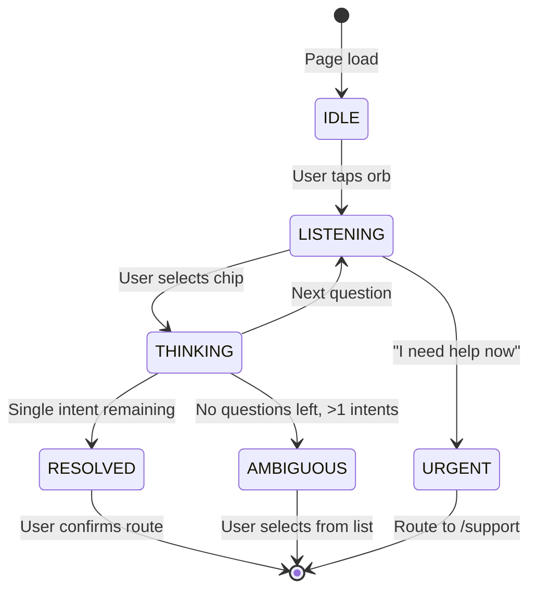

# CWP-P31-PHOS-ROUTER-2026-05

**Controlled Work Package: PHOS Router Component**  
**Document ID:** p31.cwp.phosRouter/2026-05  
**Status:** ACTIVE / PENDING IMPLEMENTATION  
**Spoon Estimate:** 3 🥄🥄🥄  
**Priority:** P1 (Blocks Bin A surface registration)

---

## 1. INTENT

Merge the structural logic from Kimi's "PhosOS v2.1" with the soul of bonding-soup's PHOS voice guide component into a single, canonical PHOS router.

The router provides **deterministic, non-evaluative navigation** for neurodivergent users, replacing traditional menu systems with a 3-4 question decision tree that reduces Shannon entropy to near-zero in O(log n) interactions.

---

## 2. TAG-OUT BOUNDARIES (WHAT WE DO NOT DO)

1. **NO LLM in the loop** — The router is a local state machine. No voice data leaves the device.
2. **NO pop-ups or modal interruptions** — The router orb is always available but never intrusive.
3. **NO "Jarvis" persona** — The router has no personality. It mirrors, guides, and routes. It does not perform.
4. **NO Web Speech API until P1** — Voice input is a future enhancement, not P0.
5. **NO external analytics** — Interaction patterns stay in LocalStorage/IndexedDB. No telemetry to Cloudflare or third parties.

---

## 3. MERGED ARCHITECTURE

### 3.1 Structure from Kimi (Keep)

```javascript
// Intent registry — extensible JSON catalog
const intents = [
  { id: 'PASSPORT', label: 'Cognitive Passport', path: '/passport' },
  { id: 'OPS', label: 'Operator Desk', path: '/ops' },
  { id: 'GARDEN', label: 'The Garden', path: '/garden' },
  { id: 'BUFFER', label: 'The Buffer', path: '/buffer' },
  { id: 'VIBE', label: 'Vibe Environment', path: '/vibe' },
  { id: 'GEODESIC', label: 'Geodesic Builder', path: '/geodesic' },
  { id: 'LIBRARY', label: 'Document Library', path: '/doc-library' },
  { id: 'CORTEX', label: 'Centaur Pack', path: '/cortex' },
  { id: 'BUILD', label: 'WCD Intake', path: '/build' },
  { id: 'OBSERVATORY', label: 'Static Data Dome', path: '/observatory' }
];

// 3-question decision tree
const questions = [
  { id: 'Q_CHILD', text: "Are the children with you?", 
    yes: ['GARDEN', 'GEODESIC'], 
    no: ['OPS', 'BUFFER', 'VIBE', 'PASSPORT', 'LIBRARY', 'CORTEX', 'BUILD', 'OBSERVATORY'] },
  { id: 'Q_LEGAL', text: "Is there an external deadline/voltage?", 
    yes: ['BUFFER', 'OPS', 'CORTEX'], 
    no: ['GARDEN', 'GEODESIC', 'VIBE', 'PASSPORT', 'LIBRARY', 'BUILD', 'OBSERVATORY'] },
  { id: 'Q_TECH', text: "Are we in 'Mechanic' mode?", 
    yes: ['OPS', 'VIBE', 'GEODESIC', 'CORTEX', 'BUILD', 'OBSERVATORY'], 
    no: ['GARDEN', 'PASSPORT', 'BUFFER', 'LIBRARY'] }
];

// Bayesian elimination (filterSet logic)
function handle(isYes, qId) {
  const q = questions.find(x => x.id === qId);
  state.history.push(q.id);
  const filterSet = isYes ? q.yes : q.no;
  state.activePool = state.activePool.filter(i => filterSet.includes(i.id));
  think(); // Next question or present result
}
```

### 3.2 Soul from Bonding-Soup (Keep)

From `PHOS_VOICE_GUIDE.md` and `p31-phos-voice.json`:

1. **Non-evaluative** — Never judges user input as "wrong" or "incomplete"
2. **Mirrors stimming** — Repetitive actions (tapping the orb) are features, not bugs
3. **Handles grief** — "I don't know" is a valid answer that routes to `/support`
4. **Zero cognitive tax** — No memory burden; state is visible, recoverable
5. **Gray Rock default** — Safe mode strips all animation, reduces to single chip

### 3.3 New Merged Component

```
p31-phos-router.js (browser module)
├── p31-phos-router.css (scoped styles, canonical tokens only)
├── p31-phos-intents.json (50+ intent mappings)
└── p31-phos-voice.json (12-slot voice map, 1 OPERATOR-VOICE)
```

---

## 4. UI SPECIFICATION

### 4.1 The Orb (Idle State)

- **Position:** Fixed, bottom-right (2rem from edges)
- **Size:** 60px diameter
- **Appearance:** K₄ tetrahedron SVG, 2px stroke, no fill
- **Color:** `var(--p31-cyan)` default, `var(--p31-coral)` for urgent mode
- **Animation:** Subtle 4s pulse (respects `prefers-reduced-motion`)
- **Shadow:** `var(--p31-shadow-glowTeal)` on hover

### 4.2 The Bubble (Active State)

- **Position:** Absolute above orb (bottom: 80px, right: 0)
- **Size:** 320px max-width
- **Background:** `var(--p31-surface2)` with `backdrop-filter: blur(20px)`
- **Border:** 1px solid `var(--p31-glass-border)`
- **Border-radius:** 1.5rem (24px)
- **Content:** Question text + 2-4 tappable chips

### 4.3 The Chips (Interaction)

```css
.p31-phos-chip {
  display: block;
  width: 100%;
  padding: 0.8rem;
  margin-bottom: 0.5rem;
  background: rgba(255,255,255,0.03);
  border: 1px solid rgba(255,255,255,0.1);
  border-radius: 0.75rem;
  color: var(--p31-cloud);
  font-family: var(--p31-font-mono);
  font-size: 0.8rem;
  text-align: left;
  cursor: pointer;
  transition: all 0.2s;
}
.p31-phos-chip:hover {
  background: var(--p31-teal-faint);
  border-color: var(--p31-cyan);
  color: var(--p31-paper);
}
```

### 4.4 Safe Mode Adaptation

```css
body.safe-mode .p31-phos-orb {
  filter: grayscale(1);
  animation: none;
}
body.safe-mode .p31-phos-bubble {
  /* Single chip only, no animation */
  max-height: 200px;
  overflow-y: auto;
}
body.safe-mode .p31-phos-chip {
  /* Reduced touch targets for precision */
  padding: 1rem 0.8rem;
  font-size: 1rem;
}
```

---

## 5. STATE MACHINE



---

## 6. TEXT INPUT (Fuse.js Integration)

```javascript
import Fuse from 'fuse.js';

const fuse = new Fuse(intents, {
  keys: ['label', 'keywords', 'aliases'],
  threshold: 0.3, // Fuzzy match tolerance
  includeScore: true
});

function handleTextInput(text) {
  const results = fuse.search(text);
  if (results.length === 1) {
    presentResult(results[0].item);
  } else if (results.length > 1) {
    presentAmbiguous(results.map(r => r.item));
  } else {
    presentNoMatch(); // Suggest STANDARD_CHIPS
  }
}
```

---

## 7. INTEGRATION WITH EXISTING SURFACES

### 7.1 Astro Component

```astro
---
// src/components/PhosRouter.astro
export interface Props {
  initialMode?: 'default' | 'safe' | 'urgent';
  context?: 'hub' | 'doc' | 'tool';
}
const { initialMode = 'default', context = 'hub' } = Astro.props;
---

<div id="phos-mount" data-mode={initialMode} data-context={context}></div>
<script src="/js/p31-phos-router.js" type="module"></script>
```

### 7.2 Vanilla HTML (for Bin A survivors)

```html
<!-- In passport.html, geodesic.html, etc. -->
<script type="module">
  import { PhosRouter } from '/js/p31-phos-router.js';
  const router = new PhosRouter({
    mount: '#phos-mount',
    intents: ['/data/phos-intents-passport.json'], // Surface-specific overrides
    safeMode: document.body.classList.contains('safe-mode')
  });
</script>
```

---

## 8. TESTING REQUIREMENTS

### 8.1 Unit Tests (Vitest)

```javascript
// tests/phos-router.test.js
describe('PHOS Router', () => {
  test('resolves to single intent in ≤4 questions', () => {
    const router = new PhosRouter({ intents: testIntents });
    router.answer('Q_CHILD', false);
    router.answer('Q_LEGAL', true);
    expect(router.activePool).toHaveLength(1);
    expect(router.activePool[0].id).toBe('BUFFER');
  });
  
  test('safe mode strips animations', () => {
    document.body.classList.add('safe-mode');
    const router = new PhosRouter({ mount: '#test' });
    expect(router.orb.style.animation).toBe('none');
  });
  
  test('urgent mode bypasses all questions', () => {
    const router = new PhosRouter({ mode: 'urgent' });
    expect(router.state).toBe('RESOLVED');
    expect(router.resolvedIntent.id).toBe('SUPPORT');
  });
});
```

### 8.2 E2E Tests (Playwright)

```javascript
// e2e/phos-router.spec.js
test('completes routing without mouse', async ({ page }) => {
  await page.goto('/passport');
  await page.keyboard.press('Tab'); // Focus orb
  await page.keyboard.press('Enter'); // Activate
  await page.keyboard.press('ArrowDown');
  await page.keyboard.press('Enter'); // Select first chip
  // ... continue until resolved
  await expect(page.locator('[data-testid="phos-result"]')).toBeVisible();
});
```

---

## 9. ACCEPTANCE CRITERIA

- [ ] Router resolves any intent in ≤4 questions (O(log n) verified)
- [ ] Safe mode passes Lighthouse accessibility = 1.0
- [ ] No external network requests during routing
- [ ] Bundle size < 15KB gzipped (Fuse.js + router logic)
- [ ] 26 test assertions from bonding-soup PHOS guide preserved
- [ ] Voice input stubbed for P1 (Web Speech API feature flag)
- [ ] Registered in `public-line.json` as `component: "phos-router"`

---

## 10. DEPENDENCIES

| Package | Purpose | Size |
|---------|---------|------|
| `fuse.js` | Fuzzy text matching | ~7KB |
| `zod` (dev) | Intent schema validation | 0KB prod |

---

## 11. SIGN-OFF

**CWP Author:** Opus 4.6 Web (Convergence Architect)  
**Kimi Contributor:** Session 2026-05-03 (Prototyping Agent)  
**Operator Approval:** W.Johnson-001 (Pending)  
**Status:** Awaiting implementation assignment

---

**Related Documents:**
- `docs/operator/CONVERGENCE-CORRECTIONS-2026-05-03.md`
- `docs/P31-MASTER-TECHNICAL-SUITE.md` §1.3 (Bayesian Flowchart)
- `cognitive-passport/lib/p31-phos-voice.json` (Voice map)
- `p31-alignment.json` derivation `phos-router-component`
