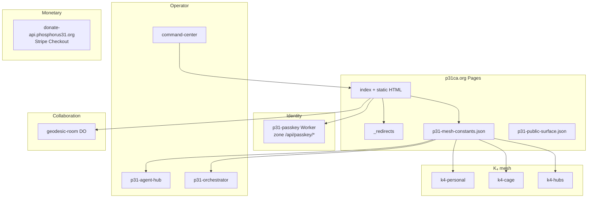

# P31 ecosystem — production “11/10” matrix

**Status:** normative checklist. **Updated:** 2026-04-26.

“**11/10**” here means: **every public promise has a live backend**, **every worker URL in `p31-constants.json` answers health**, **the hub ships the static contract bundle**, **glass box is green** (with documented exceptions), and **deploy order is repeatable**. This is a *state*, not one commit.

---

## 1. What “everything connected” means

**Cloudflare Pages + `_redirects`:** Do not add **`/foo` → `/foo.html` 301** when Pages already sends **`/foo.html` → `/foo` 308** — that creates an **infinite redirect** (seen on `/privacy`, `/auth`, `/delta`, etc.). Use **clean paths only** for those files, or only use `_redirects` when the short path **differs** from the basename (e.g. `/passport` → `passport-generator.html`).

| Layer | Connected when… |
|--------|------------------|
| **Contracts** | `p31.ground-truth`, creator economy JSON, public surface manifest, mesh constants mirror, and `_redirects` agree; CI `verify` + `release:check` pass. |
| **Hub (p31ca.org)** | Latest `dist/` deployed: short URLs, trust pages, passport, family pack, `p31-mesh-constants.json`, `.well-known/security.txt`, passkey client paths. |
| **Identity** | Passkey Worker zone route `p31ca.org/api/passkey/*` live; onboard + `/auth` complete round-trip; `mesh.passkeyApiBasePath` matches. |
| **K₄ edge** | k4-personal, k4-cage, k4-hubs health + mesh routes match **`p31-constants.json` → `mesh.*`**; k4-hubs `PERSONAL_MESH_URL` aligned (see `verify-constants`). |
| **Rooms / builder** | GeodesicRoom Worker + static `geodesic.html` WS URL consistent with campaign contract. |
| **Operator** | Command-center health + public operator shift; `/ops/` ingest shows probes; Access-gated POST documented. |
| **Agent / orchestration** | Agent hub health; orchestrator URL returns expected status (401/403 still counts as “edge up” for glass). |
| **Monetary** | Donate-api health URLs in **`payment.*`** return 200 (Stripe Checkout Worker; `stripeApiHealthUrl` matches donate-api until a separate API host exists); creator economy JSON on hub matches ground-truth. |
| **Satellite sites** | BONDING (`bonding.publicUrl`) and org API host behave per constants; no stale links in hub registry vs ground-truth. |

---

## 2. Topology (high level)

---

## 3. Machine verification ladder (run in order)

1. **Home + hub compile:** `npm run apply:constants && npm run release:check`  
   - Fails fast on passport, ground-truth, economy, dist bundle (`verify-p31ca-dist`), k4-personal dry-run.

2. **Strict mesh (match CI):** `MESH_LIVE_STRICT=1 npm run p31:ci`  
   - Or `release:all` / `p31:all` when you intend full production parity.

3. **Live glass:** `npm run ecosystem:glass`  
   - Optional hard gate: `P31_GLASS_STRICT=1 npm run ecosystem:glass`.

4. **Hub security (when touching workers/deps):** `cd andromeda/04_SOFTWARE/p31ca && npm run security:check`.

5. **Monetary-only touch:** `npm run verify:monetary`.

Report file: `/tmp/p31_glass_report.json` (from glass script).

---

## 4. Deploy order (recommended)

Order minimizes “hub points at dead worker” windows. Adjust if a release only touches one tier.

| Step | Target | Command / path (typical) |
|------|--------|---------------------------|
| 1 | Mesh constants + registry truth | `npm run apply:constants` → commit mesh + hub data |
| 2 | k4-personal | `pnpm --filter k4-personal deploy` from `04_SOFTWARE` |
| 3 | k4-cage, k4-hubs | `npx wrangler deploy` in each package (see README) |
| 4 | GeodesicRoom | `geodesic-room/` |
| 5 | Agent hub + orchestrator | respective Worker packages (URLs must match `p31-constants.json`) |
| 6 | Passkey | `p31ca/workers/passkey` → `wrangler deploy --env production` (zone route on `p31ca.org`) |
| 7 | Command-center | `cloudflare-worker/command-center` |
| 8 | Donate-api (Stripe Checkout) | `donate-api/` — `payment.*` health URLs point here until a separate API host ships |
| 9 | **p31ca Pages** | `npm run deploy:p31ca` (home) or `p31ca` `npm run deploy` — **last** so `_redirects` and static bundle match reality |

`p31-ecosystem.json` **`deployables`** lists a subset; extend that list as you add Workers to the same release train.

---

## 5. Glass probes ↔ ownership

Probes are defined in **`p31-ecosystem.json`** (`glassProbes`). Template keys come from **`p31-constants.json`** (`mesh`, `bonding`, `payment`).

| Group | Probes (ids) | Owner action if red |
|--------|----------------|----------------------|
| mesh | k4-personal-*, k4-cage, k4-hubs, passkey register-begin, geodesic-room | Deploy/fix Worker; fix constants URL |
| orchestrator | orchestrator-status | Access/token expected; still “up” for many checks |
| command-center | command-center-health, operator-shift-public | Deploy command-center; CORS/Access |
| pages | p31ca-* short URLs, bonding | **Deploy p31ca `dist/`**; fix `_redirects` |
| contracts | public-surface, creator-economy | Deploy hub; fix JSON sync |
| monetary | donate-api-health, donate-api-health-workers-dev | Deploy donate-api; DNS; fix `payment.*` |

---

## 6. Known gaps to close for true 11/10

These are **explicit** “not done until addressed” items called out elsewhere in-repo:

- **Hub vs glass:** If Pages is behind git, **pages** probes 404 until `dist/` is deployed (not a code bug).
- **Stripe / Checkout host:** Canonical health is **`donate-api.phosphorus31.org/health`** (and workers.dev twin). A separate **`api.phosphorus31.org`** stack is **not** in fleet until DNS + Worker ship; do not point `payment.*` at it prematurely.
- **ECO vs COCKPIT:** Hub `mvpData` vs product index drift is **expected** until ECO CWP merge (`diff-index-sources` warns).
- **Orchestrator package name:** Production URL is `p31-orchestrator.trimtab-signal.workers.dev`; ensure the Worker that serves it is owned and in CI, even if the repo path is non-obvious.
- **Google bridge:** `auth.html` embeds a bridge URL; keep allowlists and Worker deploy in sync with OAuth clients.

**Repo-side vs operational:** A **home** (`bonding-soup`) checkout is **structurally** aligned for the deliverable pack when **`npm run verify`** and **`MESH_LIVE_STRICT=0 npm run release:check`** (with **`andromeda/04_SOFTWARE/p31ca`** present) are green. **Deploy, DNS, org filings, and ECO/COCKPIT merge** are tracked above and in **`docs/PLAN-11-10-FULL-ECOSYSTEM.md`** — they are not automatic from git alone.

---

## 7. Definition of Done (single sentence)

**11/10 is achieved when:** `MESH_LIVE_STRICT=1` CI is green, **`P31_GLASS_STRICT=1 ecosystem:glass`** is green (or only contains documented, intentional exceptions), p31ca **production** serves the **current** `dist/` contract bundle, and **no** `mesh.*` or `payment.*` URL in `p31-constants.json` points at a dead service.

---

## 8. Related docs

- **`docs/PLAN-11-10-FULL-ECOSYSTEM.md`** — **master program plan** (phased tracks, RACI, risks, “all of it” checklist).
- **`docs/P31-ENGINEERING-STANDARD.md`** — default gates (`verify`, `release:check`, secrets).
- **`AGENTS.md`** — layout, passport sync, security suite, deploy shortcuts.
- **`docs/MVP-DELIVERABLES-INVENTORY.md`** — grant-facing LIVE vs adjacent.
- **`docs/GEODESIC-GAME-ENGINE-INTEGRATION.md`** — GeodesicRoom wire protocol.
- **`andromeda/04_SOFTWARE/p31ca/docs/SECURITY-RUNBOOK.md`** — edge security and worker allowlist.
