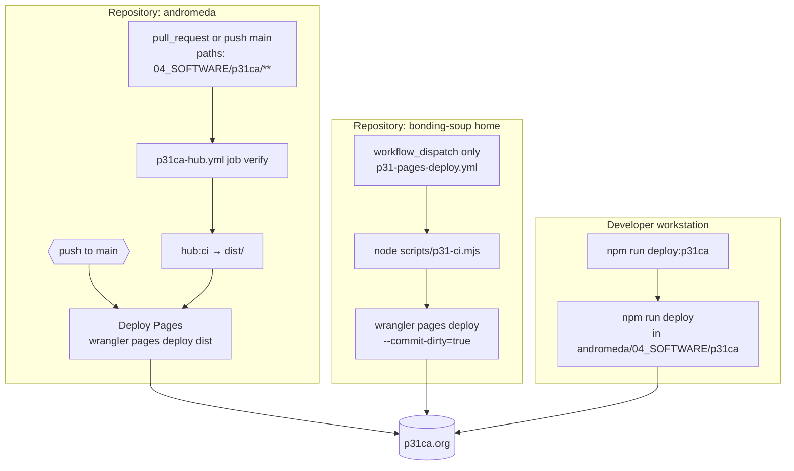

# P31 deploy spine (canonical)

**Purpose:** One place for **who deploys what**, **which workflow fires**, and **which secrets** touch production—so overlapping paths (local Wrangler, bonding-soup Actions, Andromeda Actions) do not drift into conflicting lore.

**Related:** **`docs/P31-ENGINEERING-STANDARD.md`** (gates and secrets overview). **`docs/P31-RELEASE-LADDER-CI.md`** (PR/main/nightly/proof tiers + branch protection names + deploy-day order). **`npm run connection`** (CONNECTION spine — ties this doc to ecosystem, env catalog, and hub URLs via **`scripts/p31-connection.mjs`**). **`P31_*` environment catalog:** root **`p31-env-manifest.json`**, **`npm run list:p31-env`**, **`npm run verify:p31-env`**. **Incident runbooks (mesh / hub / payments / passkeys / glass strict):** **`docs/runbooks/README.md`**.

---

## Production URL

**Hub:** `https://p31ca.org` (Cloudflare Pages project **`p31ca`**, branch **`main`**).

---

## Cloudflare primitives → monorepo paths (operator map)

**Authoritative Worker list + bindings:** `andromeda/04_SOFTWARE/p31ca/security/worker-allowlist.json` (inventory verifier walks `04_SOFTWARE/`). Paths below are under **`andromeda/04_SOFTWARE/`** unless noted.

| CF surface | Role in P31 | Code / notes |
|----------|-------------|--------------|
| **Pages** | Static hub `p31ca.org` | `p31ca/` — Astro build → `dist/`, `wrangler pages deploy` per matrix below |
| **Workers (HTTP + cron)** | Product APIs, bridges, relays | Each package with `wrangler.toml` — see allowlist **`name`** ↔ **`path`** |
| **Durable Objects** | Per-room / per-user consistency (SQLite or legacy KV DO) | e.g. **`geodesic-room`** (GEODESIC_ROOM), **`k4-personal`** (PERSONAL_AGENT), **`k4-cage`** (topology / family room DOs), **`k4-hubs`** (HUB_FUSION) |
| **KV** | Mesh scopes, challenges, OAuth sessions | Bound per Worker (e.g. `K4_MESH`, passkey `CHALLENGES`) — **not** a source of strong cross-region consistency; use DO when ordering matters |
| **D1** | Relational edge DB where bound | e.g. **`p31-passkey`** (`workers/passkey`) — see that Worker’s `wrangler.toml` |
| **R2 / Queues** | Foundry and other pipelines | e.g. `packages/p31-foundry/worker/` (home tree) — not every operator touches these on day one |

**Home repo (bonding-soup) edge:** `wcd33-global-archive/` — WCD-33 Worker (KV, CORS); see `wcd33-global-archive/DEPLOY.md`.

**Shared types / wire contracts:** e.g. `@p31/shared` — `packages/shared/src/geodesic-room-wire.ts` (locks to **`geodesic-room`** Worker); CI in **`p31ca`** runs `verify:geodesic-room-wire`.

When adding or renaming a Worker: update **allowlist**, **`p31-alignment.json`** / ecosystem entries if applicable, and **`docs/runbooks/README.md`** if the service is on-call.

---

## Flow (repos and triggers)

---

## Matrix (operator view)

| Path | Repository | Trigger | Build | Deploy command | Typical use |
|------|------------|---------|-------|----------------|-------------|
| **Andromeda CI** | `p31labs/andromeda` | PR + push `main` when `04_SOFTWARE/p31ca/**` changes | `hub:ci` in workflow | `pages deploy dist --project-name=p31ca --branch=main` (no dirty flag; clean CI tree) | Default production cadence when merging hub work in Andromeda |
| **Manual Pages + smoke** | `p31labs/bonding-soup` (home) | `workflow_dispatch` only | Full repo **`p31-ci.mjs`** then deploy from nested `p31ca` | Same project/branch; **`--commit-dirty=true`** because checkout may carry local soup changes | Operator backup: redeploy after verifying full home stack; optional Playwright prod smoke |
| **Local CLI** | Home checkout with Andromeda present | Manual | Whatever **`p31ca` package `deploy`** runs after your local verify | Same Pages project | Fast path when token is local; must match **`p31ca/DEPLOY.md`** |

**Secrets (GitHub Actions):** **`CLOUDFLARE_API_TOKEN`** (Pages deploy). **`CLOUDFLARE_ACCOUNT_ID`** where Wrangler needs it. Same names in both repos’ workflows; configure per repository in GitHub **Settings → Secrets**.

**Not a third production path:** **`npm run ecosystem:deploy`** (ordered **`deployables[].steps`** argv arrays from **`p31-ecosystem.json`** — no shell; executed sequentially per deployable) is for multi-service rollout with an explicit guard—see **`scripts/ecosystem-deploy.mjs`** and **`P31_ECOSYSTEM_DEPLOY`** in **`p31-env-manifest.json`**.

---

## Social automation

Scheduled GitHub “social dispatch” workflows are **not** authoritative for production posting. Prefer **`social.p31ca.org`** (Worker) per existing deprecation notes in Andromeda **`social-dispatch.yml`** (manual **`workflow_dispatch`** only; no cron).
