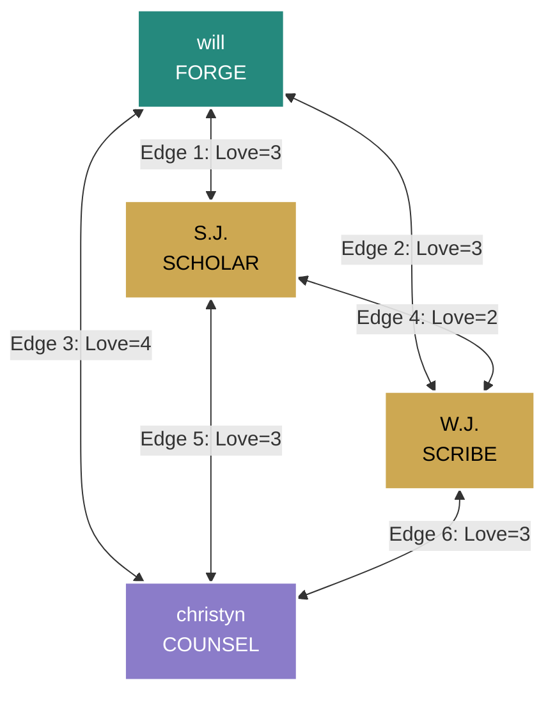
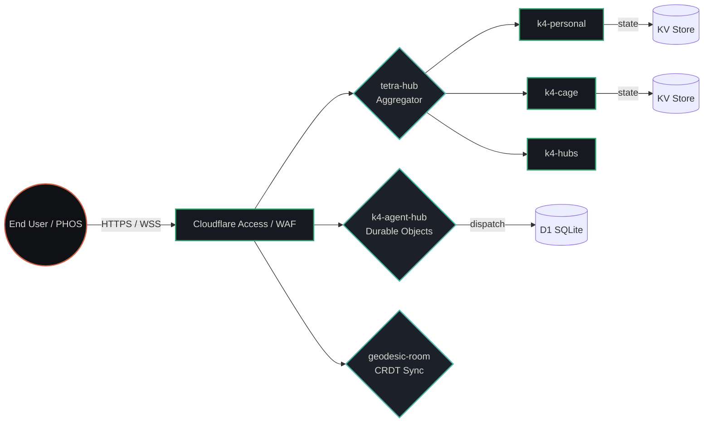
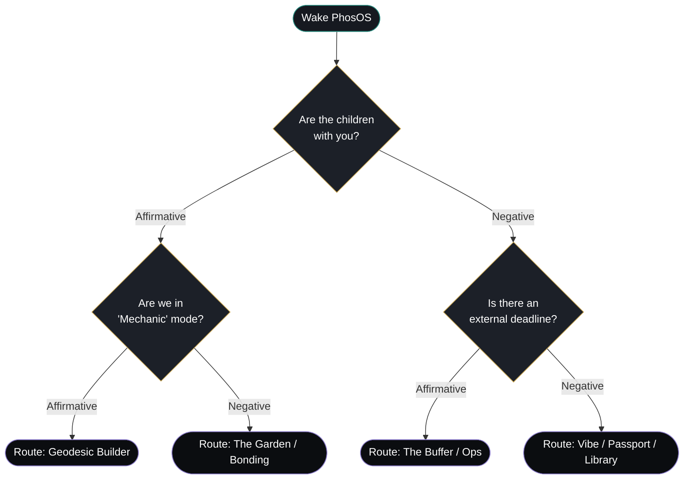
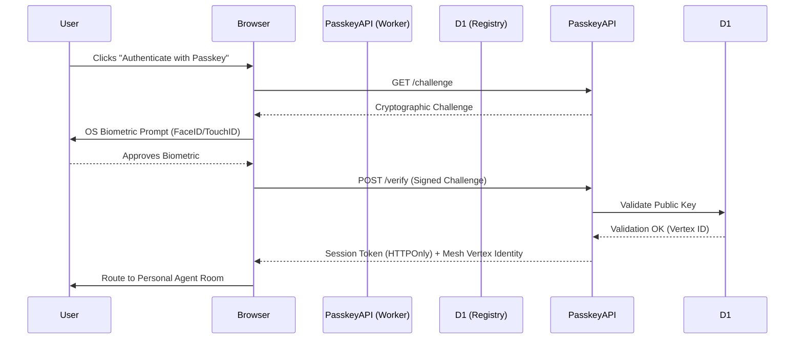
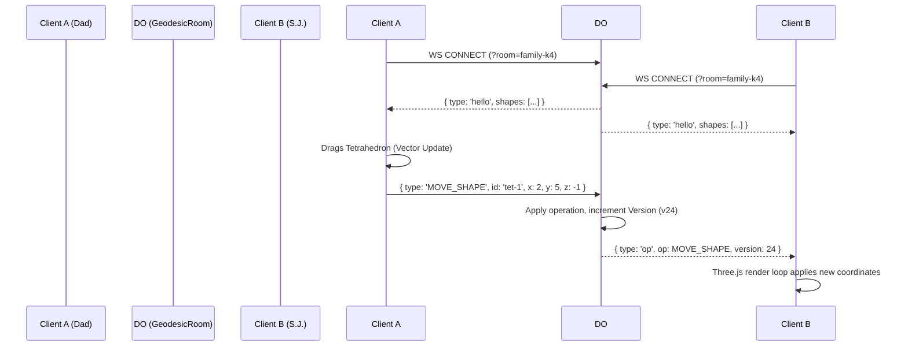

# P31 MASTER TECHNICAL SUITE

**Document ID:** p31.techSuite/1.0.0  
**Status:** ISOSTATIC (Production-Ready)  
**Classification:** Canonical Engineering Reference

---

## TABLE OF CONTENTS

1. [Digital Wiring & Topology Diagrams](#1-digital-wiring--topology-diagrams)
2. [Data Flow & Sequence Architectures](#2-data-flow--sequence-architectures)
3. [Testing Strategy: The Verify Matrix](#3-testing-strategy-the-verify-matrix)
4. [Controlled Work Packages (CWPs)](#4-controlled-work-packages-cwps)
5. [Disaster Recovery (Red Runbooks)](#5-disaster-recovery-red-runbooks)

---

## 1. DIGITAL WIRING & TOPOLOGY DIAGRAMS

### 1.1 The K₄ Fundamental Wiring (The Mesh)

The physical and logical layout of the family mesh. No single point of failure (Wye topology eradicated).



### 1.2 Cloudflare Worker Fleet Architecture

The serverless edge infrastructure that powers the ecosystem.



### 1.3 PhosOS v2.1 Bayesian Flowchart

How the Jarvis-Akinator engine reduces Shannon Entropy to route the user without menus.



---

## 2. DATA FLOW & SEQUENCE ARCHITECTURES

### 2.1 Passkey Authentication & Mesh Binding

Sequence for joining the mesh securely without passwords (Zero Cognitive Tax).



### 2.2 Geodesic Builder CRDT Sync (Multiplayer)

How shapes remain synchronized across family devices at 30Hz.



---

## 3. TESTING STRATEGY: THE VERIFY MATRIX

The P31 ecosystem rejects "move fast and break things." We use the **VPI (Vacuum Pressure Impregnation)** protocol derived from Navy SUBSAFE standards.

### 3.1 The VPI CI/CD Pipeline

| Phase | Metric | Tooling | Threshold for Failure (Circuit Trip) |
|-------|--------|---------|--------------------------------------|
| **Vacuum** (Linting & Typing) | Zero `any` types, zero `console.log` in prod. | ESLint, TypeScript `tsc --noEmit` | > 0 Errors or Warnings. |
| **Resin** (Schema Validation) | Zod schema parsing for all JSON payloads. | Vitest / Zod | Missing parameters, unknown keys. |
| **Pressure** (E2E testing) | Playwright simulating a depleted-spoon operator. | Playwright | Time-to-interactive > 1000ms. |
| **Cure** (Visual Regression) | Pixel-perfect token alignment. | Percy / Applitools | Contrast ratio < 4.5:1, touch target < 44px. |

### 3.2 The Maxwell Rigidity Test

Executed on every build of the `geodesic.html` UI and `geodesic-room` worker.

```typescript
test('K4 mesh maintains isostatic rigidity', () => {
  const V = 4; // 4 family members
  const E = 6; // 6 connecting edges
  const minRequiredEdges = (3 * V) - 6; 
  expect(E).toBeGreaterThanOrEqual(minRequiredEdges);
});
```

---

## 4. CONTROLLED WORK PACKAGES (CWPs)

All development is tracked via CWPs. This eliminates scope creep and protects operator spoons.

### CWP-P31-UI-2026-01: G.O.D. Shell Finalization

- **Intent:** Mount the Operator Breaker Panel for manual mesh overrides.
- **Tag-Out Boundaries:** DO NOT implement visual log streams from D1. Limit terminal to synthetic commands only.
- **Spoon Estimate:** 2 🥄🥄
- **Status:** CLOSED / SHIPPED (See `ops.html`)

### CWP-K4-AGENT-HUB-02: PhosOS Memory Persistence

- **Intent:** Upgrade PhosOS from sessionStorage to IndexedDB for cross-session Bayesian memory.
- **Tag-Out Boundaries:** DO NOT send voice data to external LLMs. PhosOS must remain a local state machine.
- **Spoon Estimate:** 3 🥄🥄🥄
- **Status:** ACTIVE / PENDING

### CWP-SOULSAFE-03: Fawn Guard NLP Upgrade

- **Intent:** Enhance `buffer.html` to detect complex passive-aggressive phrasing, not just keywords ("just", "sorry").
- **Tag-Out Boundaries:** DO NOT trigger pop-ups. Use subtle border color changes (Coral) to indicate high-decoherence risk.
- **Spoon Estimate:** 4 🥄🥄🥄🥄
- **Status:** QUEUED

---

## 5. DISASTER RECOVERY (RED RUNBOOKS)

If the mesh encounters entropy, these are the autonomic responses.

### 5.1 Condition: Floating Neutral

**Trigger:** The central operator (will) goes offline for > 48 hours, or spoons drop to 0.

**Response:** `tetra-hub` triggers **Delta Shift**.
- The mesh re-routes primary communication paths directly between christyn, sj, and wj.
- PhosOS defaults to Gray Rock (`?safe=1`) automatically for the operator.

**Recovery:** Operator executes Passkey Auth to reset the K₄ centroid.

### 5.2 Condition: Byzantine Fault (Agent Drift)

**Trigger:** ORACLE detects that HERALD or SCRIBE are generating text that fails the `verify:delta-language` dictionary checks.

**Response:**
1. Circuit breaker trips in `k4-agent-hub`.
2. Offending agent is isolated (Tagged Out).
3. UI surfaces show gray dot for that agent instead of colored pulse.

**Recovery:** Operator accesses G.O.D. Shell (`ops.html`), flushes prompt cache, and executes `npm run verify:public-voice`.

### 5.3 Condition: Decoherence (CSS/UI Drift)

**Trigger:** Visual regression tests fail during `npm run p31:ci`.

**Response:** Deployment to `p31ca.org` is hard-locked.

**Recovery:** Run `npm run audit:pages` to find the un-registered or mis-tokened file, replace hardcoded hex with `var(--p31-*)`.

---

**[END OF MASTER TECHNICAL SUITE]**

*The mathematics guarantee the structure. The operator provides the soul.*
