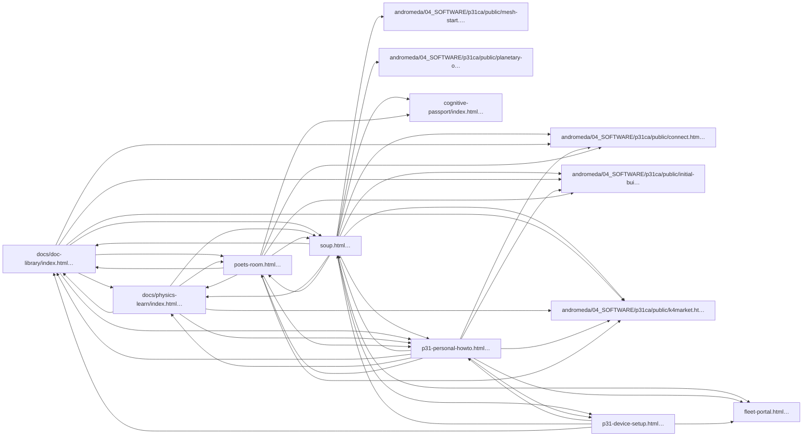
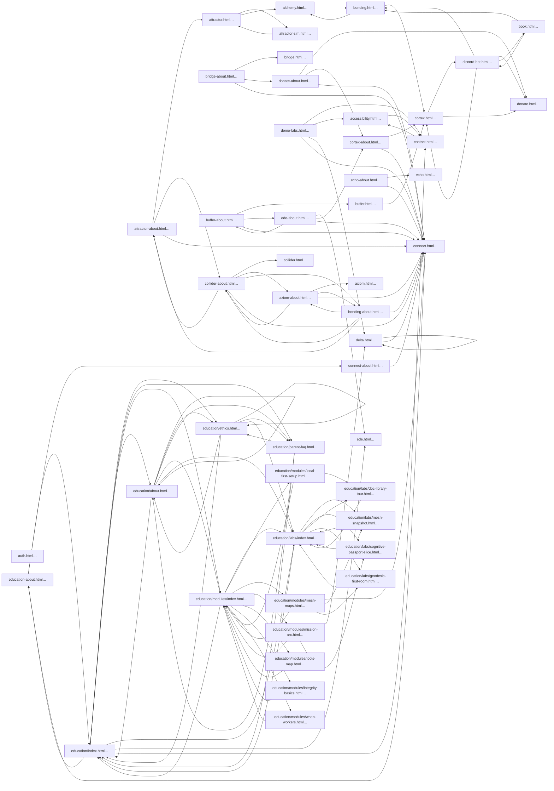

# P31 user navigation tree & link audit

**Generated:** 2026-04-28T02:28:00.511Z — rerun `npm run nav:report`.

| Artifact | Purpose |
|----------|---------|
| This file | Human review: fan-out, orphans, jitterbug-style traversal |
| `docs/generated/nav-edges-bonding.tsv` | Directed edges BondingSoup |
| `docs/generated/nav-edges-p31ca-public.tsv` | Directed edges hub `public/` |

## Concepts

| Term | Definition |
|------|-------------|
| **Directed graph** | Page = vertex; `<a href>` = tagged edge toward another asset |
| **Fan-out** | Immediate choices on one page (= out-degree toward local `.html` files) |
| **Jitterbug traversal** | Any user session = a walk along directed edges — Fuller's jitterbug unfolds the same polyhedron combinatorially; here we unfold *every* instantaneous choice per page.
| **Orphans** | Files in crawl universe whose graph has no inbound path from seeded entry points |

## C.A.R.S. (repo root demo server)

**Filesystem root:** `.`

**Seeds:** `soup.html`, `fleet-portal.html`, `cognitive-passport/index.html`, `docs/doc-library/index.html`, `docs/physics-learn/index.html`, `p31-personal-howto.html`, `p31-device-setup.html`, `poets-room.html`

**Traversal stops at edges into:** `andromeda/*` *(pages still counted as reachable targets from outside; crawler does not open them).*

| Metric | Count | Notes |
|--------|------:|-------|
| HTML in crawl universe | 12 | |
| Reachable internally | 13 | BFS from seeds |
| Orphans | 4 | in universe only |
| Broken (no file after redirects) | 0 | |
| Outbound https / other hosts | 126 | |
| `/` SPA home links | 6 | not missing — deploy root |
| `.md` anchors | 43 | prose, not shipped HTML routes |
| Non-HTML file links | 1 | e.g. `.nvmrc`, config |
| `_redirects` entries loaded | 0 | |

### Orphan HTML (4) — not reached from seeds

- `spikes/d20-geodesic-icosahedron/omnibus-icosa-three-r128.html`
- `spikes/d20-geodesic-icosahedron/react/index.html`
- `spikes/posner-stable/index.html`
- `spikes/spatial-chat/spike-02-demo.html`

### Markdown-linked: 43 anchors (skipped for HTML QA)

### Fan-out (distinct internal `.html` targets)

| Page | Out-degree |
|------|------------|
| `soup.html` | 12 |
| `p31-personal-howto.html` | 9 |
| `poets-room.html` | 8 |
| `docs/doc-library/index.html` | 7 |
| `docs/physics-learn/index.html` | 5 |
| `p31-device-setup.html` | 4 |
| `andromeda/04_SOFTWARE/p31ca/public/connect.html` | 0 |
| `andromeda/04_SOFTWARE/p31ca/public/initial-build.html` | 0 |
| `andromeda/04_SOFTWARE/p31ca/public/k4market.html` | 0 |
| `andromeda/04_SOFTWARE/p31ca/public/mesh-start.html` | 0 |
| `andromeda/04_SOFTWARE/p31ca/public/planetary-onboard.html` | 0 |
| `cognitive-passport/index.html` | 0 |
| `fleet-portal.html` | 0 |

### Edge sample (140 rows; full dump → generated TSV)

| From | href | → |
|------|------|---|
| `docs/doc-library/index.html` | ../../andromeda/04_SOFTWARE/p31ca/public/connect.html | `andromeda/04_SOFTWARE/p31ca/public/connect.html` |
| `docs/doc-library/index.html` | ../../andromeda/04_SOFTWARE/p31ca/public/initial-build.html | `andromeda/04_SOFTWARE/p31ca/public/initial-build.html` |
| `docs/doc-library/index.html` | ../../andromeda/04_SOFTWARE/p31ca/public/k4market.html | `andromeda/04_SOFTWARE/p31ca/public/k4market.html` |
| `docs/doc-library/index.html` | ../physics-learn/index.html | `docs/physics-learn/index.html` |
| `docs/doc-library/index.html` | ../../p31-personal-howto.html | `p31-personal-howto.html` |
| `docs/doc-library/index.html` | ../../poets-room.html | `poets-room.html` |
| `docs/doc-library/index.html` | ../../soup.html | `soup.html` |
| `docs/physics-learn/index.html` | ../../andromeda/04_SOFTWARE/p31ca/public/k4market.html | `andromeda/04_SOFTWARE/p31ca/public/k4market.html` |
| `docs/physics-learn/index.html` | ../doc-library/index.html | `docs/doc-library/index.html` |
| `docs/physics-learn/index.html` | ../../p31-personal-howto.html | `p31-personal-howto.html` |
| `docs/physics-learn/index.html` | ../../poets-room.html | `poets-room.html` |
| `docs/physics-learn/index.html` | ../../soup.html | `soup.html` |
| `p31-device-setup.html` | docs/doc-library/index.html | `docs/doc-library/index.html` |
| `p31-device-setup.html` | fleet-portal.html | `fleet-portal.html` |
| `p31-device-setup.html` | p31-personal-howto.html | `p31-personal-howto.html` |
| `p31-device-setup.html` | soup.html | `soup.html` |
| `p31-personal-howto.html` | andromeda/04_SOFTWARE/p31ca/public/connect.html | `andromeda/04_SOFTWARE/p31ca/public/connect.html` |
| `p31-personal-howto.html` | andromeda/04_SOFTWARE/p31ca/public/initial-build.html | `andromeda/04_SOFTWARE/p31ca/public/initial-build.html` |
| `p31-personal-howto.html` | andromeda/04_SOFTWARE/p31ca/public/k4market.html | `andromeda/04_SOFTWARE/p31ca/public/k4market.html` |
| `p31-personal-howto.html` | docs/doc-library/index.html | `docs/doc-library/index.html` |
| `p31-personal-howto.html` | docs/physics-learn/index.html | `docs/physics-learn/index.html` |
| `p31-personal-howto.html` | fleet-portal.html | `fleet-portal.html` |
| `p31-personal-howto.html` | p31-device-setup.html | `p31-device-setup.html` |
| `p31-personal-howto.html` | poets-room.html | `poets-room.html` |
| `p31-personal-howto.html` | soup.html | `soup.html` |
| `poets-room.html` | andromeda/04_SOFTWARE/p31ca/public/connect.html | `andromeda/04_SOFTWARE/p31ca/public/connect.html` |
| `poets-room.html` | andromeda/04_SOFTWARE/p31ca/public/initial-build.html | `andromeda/04_SOFTWARE/p31ca/public/initial-build.html` |
| `poets-room.html` | andromeda/04_SOFTWARE/p31ca/public/k4market.html | `andromeda/04_SOFTWARE/p31ca/public/k4market.html` |
| `poets-room.html` | cognitive-passport/index.html | `cognitive-passport/index.html` |
| `poets-room.html` | docs/doc-library/index.html | `docs/doc-library/index.html` |
| `poets-room.html` | docs/physics-learn/index.html | `docs/physics-learn/index.html` |
| `poets-room.html` | p31-personal-howto.html | `p31-personal-howto.html` |
| `poets-room.html` | soup.html | `soup.html` |
| `soup.html` | andromeda/04_SOFTWARE/p31ca/public/connect.html | `andromeda/04_SOFTWARE/p31ca/public/connect.html` |
| `soup.html` | andromeda/04_SOFTWARE/p31ca/public/initial-build.html | `andromeda/04_SOFTWARE/p31ca/public/initial-build.html` |
| `soup.html` | andromeda/04_SOFTWARE/p31ca/public/k4market.html | `andromeda/04_SOFTWARE/p31ca/public/k4market.html` |
| `soup.html` | andromeda/04_SOFTWARE/p31ca/public/mesh-start.html | `andromeda/04_SOFTWARE/p31ca/public/mesh-start.html` |
| `soup.html` | andromeda/04_SOFTWARE/p31ca/public/planetary-onboard.html | `andromeda/04_SOFTWARE/p31ca/public/planetary-onboard.html` |
| `soup.html` | cognitive-passport/index.html | `cognitive-passport/index.html` |
| `soup.html` | docs/doc-library/index.html | `docs/doc-library/index.html` |
| `soup.html` | docs/physics-learn/index.html | `docs/physics-learn/index.html` |
| `soup.html` | fleet-portal.html | `fleet-portal.html` |
| `soup.html` | p31-device-setup.html | `p31-device-setup.html` |
| `soup.html` | p31-personal-howto.html | `p31-personal-howto.html` |
| `soup.html` | poets-room.html | `poets-room.html` |

### Mermaid (reachable spine excerpt — readability)

## p31ca.org Pages build (`public/` as served root)

**Filesystem root:** `andromeda/04_SOFTWARE/p31ca/public`

**Seeds:** `welcome.html`, `bonding.html`, `connect.html`, `education/index.html`, `education/portal/index.html`

| Metric | Count | Notes |
|--------|------:|-------|
| HTML in crawl universe | 214 | |
| Reachable internally | 123 | BFS from seeds |
| Orphans | 91 | in universe only |
| Broken (no file after redirects) | 36 | |
| Outbound https / other hosts | 291 | |
| `/` SPA home links | 278 | not missing — deploy root |
| `.md` anchors | 0 | prose, not shipped HTML routes |
| Non-HTML file links | 2 | e.g. `.nvmrc`, config |
| `_redirects` entries loaded | 37 | |

### Orphan HTML (91) — not reached from seeds

- `agent/bonding-relay/index.html`
- `agent/command-center/index.html`
- `agent/cortex-benefits/index.html`
- `agent/cortex-content/index.html`
- `agent/cortex-finance/index.html`
- `agent/cortex-grant/index.html`
- `agent/cortex-kofi/index.html`
- `agent/cortex-legal/index.html`
- `agent/discord-bot/index.html`
- `agent/donate-api/index.html`
- `agent/genesis-gate/index.html`
- `agent/geodesic-room/index.html`
- `agent/k4-cage/index.html`
- `agent/k4-hubs/index.html`
- `agent/k4-personal/index.html`
- `agent/kenosis-mesh/index.html`
- `agent/p31-agent-hub/index.html`
- `agent/p31-bouncer/index.html`
- `agent/p31-command-center/index.html`
- `agent/p31-cortex/index.html`
- `agent/p31-forge/index.html`
- `agent/p31-google-bridge/index.html`
- `agent/p31-hearing-ops/index.html`
- `agent/p31-orchestrator/index.html`
- `agent/p31-passkey/index.html`
- `agent/p31-pwa/index.html`
- `agent/p31-quantum-edge/index.html`
- `agent/p31-social-broadcast/index.html`
- `agent/p31-social-worker/index.html`
- `agent/p31-state/index.html`
- `agent/p31-telemetry/index.html`
- `agent/p31-workers/index.html`
- `agent/p31ca/index.html`
- `agent/spaceship-relay/index.html`
- `alchemy-about.html`
- `appointment-tracker-about.html`
- `book-about.html`
- `budget-tracker-about.html`
- `builder.html`
- `canon-demo-about.html`
- `cockpit.html`
- `contact-locker-about.html`
- `content-forge-about.html`
- `content-forge.html`
- `d20-omnibus-icosa.html`
- `delta-hiring/index.html`
- `dev-workbench.html`
- `discord-bot-about.html`
- `doc-library/index.html`
- `economy.html`
- `ecosystem.html`
- `editor.html`
- `fleet-portal.html`
- `fluid.html`
- `forge-about.html`
- `forge.html`
- `health.html`
- `ide.html`
- `kids-growth-about.html`
- `larmor.html`
- `lattice.html`
- `legal-evidence-about.html`
- `liminal-about.html`
- `liminal.html`
- `looper.html`
- `magic-crystal.html`
- `medical-tracker-about.html`
- `movement.html`
- `node-one-about.html`
- `node-zero-about.html`
- `oqe-icosa-about.html`
- `oqe-icosa.html`
- `orbits.html`
- `p31-delta-hiring-about.html`
- `particles.html`
- `poetry.html`
- `qg-ide-about.html`
- `qg-ide.html`
- `quantum-core-about.html`
- `quantum-life-os-about.html`
- … *11 more (see crawl universe glob)*

### Broken filesystem targets

| From | href | note |
|------|------|------|
| `family-sovereign-pack.html` | `/p31-super-centaur-pack.json` | unresolved / path |
| `family-sovereign-pack.html` | `/creator-economy.json` | unresolved / path |
| `family-sovereign-pack.html` | `/p31-welcome-packages.json` | unresolved / path |
| `p31-super-centaur-starter.html` | `/p31-super-centaur-pack.json` | unresolved / path |
| `p31-super-centaur-starter.html` | `/p31-super-centaur-pack.json` | unresolved / path |
| `p31-super-centaur-starter.html` | `/p31-welcome-packages.json` | unresolved / path |
| `p31-super-centaur-starter.html` | `/creator-economy.json` | unresolved / path |
| `security-disclosure.html` | `/.well-known/security.txt` | unresolved / path |
| `quantum-clock.html` | `/dome/` | unresolved / path |
| `privacy.html` | `/creator-economy.json` | unresolved / path |
| `donate.html` | `STRIPE_LINK_10` | missing |
| `donate.html` | `STRIPE_LINK_25` | missing |
| `donate.html` | `STRIPE_LINK_50` | missing |
| `donate.html` | `STRIPE_LINK_CUSTOM` | missing |
| `p31-canon-demo.html` | `/p31-style.css` | unresolved / path |
| `open-source.html` | `/creator-economy.json` | unresolved / path |
| `open-source.html` | `/p31-super-centaur-pack.json` | unresolved / path |
| `open-source.html` | `/p31-public-surface.json` | unresolved / path |
| `education/modules/mesh-maps.html` | `/ops/` | unresolved / path |
| `integrations-about.html` | `/integrations/index.html` | unresolved / path |
| `integrations-about.html` | `/integrations/index.html` | unresolved / path |
| `integrations-about.html` | `/integrations/index.html` | unresolved / path |
| `integrations-about.html` | `/integrations/index.html` | unresolved / path |
| `integrations-about.html` | `/integrations/index.html` | unresolved / path |
| `demo-labs.html` | `/p31-public-surface.json` | unresolved / path |
| `demo-labs.html` | `/p31-live-fleet.json` | unresolved / path |
| `demo-labs.html` | `/ops/` | unresolved / path |
| `live-fleet-demo.html` | `/ops/` | unresolved / path |
| `live-fleet-demo.html` | `/p31-live-fleet.json` | unresolved / path |
| `live-fleet-demo.html` | `/ops/` | unresolved / path |
| `fleet-agents.html` | `/p31-fleet-entities.json` | unresolved / path |
| `fleet-agents.html` | `/ops/` | unresolved / path |
| `fleet-agents.html` | `/ops/` | unresolved / path |
| `fleet-agents.html` | `/ops/` | unresolved / path |
| `vision.html` | `/dome/` | unresolved / path |
| `vision.html` | `/ops/` | unresolved / path |

### Fan-out (distinct internal `.html` targets)

| Page | Out-degree |
|------|------------|
| `demo-labs.html` | 18 |
| `education/index.html` | 17 |
| `vision.html` | 14 |
| `family-sovereign-pack.html` | 11 |
| `education/about.html` | 9 |
| `education/modules/index.html` | 9 |
| `kids-home.html` | 9 |
| `mesh-start.html` | 9 |
| `p31-super-centaur-starter.html` | 9 |
| `delta.html` | 8 |
| `education-about.html` | 8 |
| `accessibility.html` | 7 |
| `attractor-about.html` | 7 |
| `axiom-about.html` | 7 |
| `bridge-about.html` | 7 |
| `buffer-about.html` | 7 |
| `collider-about.html` | 7 |
| `cortex-about.html` | 7 |
| `donate-about.html` | 7 |
| `echo-about.html` | 7 |
| `ede-about.html` | 7 |
| `education/ethics.html` | 7 |
| `k4market-about.html` | 7 |
| `kenosis-about.html` | 7 |
| `kinematics-about.html` | 7 |
| `live-fleet-demo.html` | 7 |
| `mission-control-about.html` | 7 |
| `observatory-about.html` | 7 |
| `phenix-os-about.html` | 7 |
| `planetary-onboard-about.html` | 7 |
| `prism-about.html` | 7 |
| `quantum-family-about.html` | 7 |
| `resonance-about.html` | 7 |
| `signal-about.html` | 7 |
| `simple-sovereignty.html` | 7 |
| `sovereign-about.html` | 7 |
| `spaceship-earth-about.html` | 7 |
| `tether-about.html` | 7 |
| `tomography-about.html` | 7 |
| `bonding-about.html` | 6 |
| `connect-about.html` | 6 |
| `education/modules/mesh-maps.html` | 6 |
| … | *see TSV* |

### Edge sample (140 rows; full dump → generated TSV)

| From | href | → |
|------|------|---|
| `accessibility.html` | /contact | `contact.html` |
| `accessibility.html` | /family-pack | `family-sovereign-pack.html` |
| `accessibility.html` | /oss | `open-source.html` |
| `accessibility.html` | /p31-canon-demo.html | `p31-canon-demo.html` |
| `accessibility.html` | /privacy | `privacy.html` |
| `accessibility.html` | /security | `security-disclosure.html` |
| `accessibility.html` | /terms | `terms.html` |
| `alchemy.html` | bonding.html | `bonding.html` |
| `alchemy.html` | kenosis.html | `kenosis.html` |
| `alchemy.html` | node-one.html | `node-one.html` |
| `alchemy.html` | quantum-core.html | `quantum-core.html` |
| `attractor-about.html` | /attractor.html | `attractor.html` |
| `attractor-about.html` | /collider-about.html | `collider-about.html` |
| `attractor-about.html` | /mesh | `connect.html` |
| `attractor-about.html` | /geodesic.html | `geodesic.html` |
| `attractor-about.html` | /build | `initial-build.html` |
| `attractor-about.html` | /kenosis-about.html | `kenosis-about.html` |
| `attractor-about.html` | /observatory-about.html | `observatory-about.html` |
| `attractor-sim.html` | attractor.html | `attractor.html` |
| `attractor.html` | alchemy.html | `alchemy.html` |
| `attractor.html` | attractor-sim.html | `attractor-sim.html` |
| `attractor.html` | kenosis.html | `kenosis.html` |
| `attractor.html` | spaceship-earth.html | `spaceship-earth.html` |
| `auth.html` | /planetary-onboard.html | `planetary-onboard.html` |
| `axiom-about.html` | /axiom.html | `axiom.html` |
| `axiom-about.html` | /bonding-about.html | `bonding-about.html` |
| `axiom-about.html` | /collider-about.html | `collider-about.html` |
| `axiom-about.html` | /mesh | `connect.html` |
| `axiom-about.html` | /geodesic.html | `geodesic.html` |
| `axiom-about.html` | /build | `initial-build.html` |
| `axiom-about.html` | /sovereign-about.html | `sovereign-about.html` |
| `bonding-about.html` | /attractor-about.html | `attractor-about.html` |
| `bonding-about.html` | /axiom-about.html | `axiom-about.html` |
| `bonding-about.html` | /collider-about.html | `collider-about.html` |
| `bonding-about.html` | /mesh | `connect.html` |
| `bonding-about.html` | /geodesic.html | `geodesic.html` |
| `bonding-about.html` | /build | `initial-build.html` |
| `bonding.html` | alchemy.html | `alchemy.html` |
| `bonding.html` | cortex.html | `cortex.html` |
| `bonding.html` | genesis-gate.html | `genesis-gate.html` |
| `bonding.html` | spaceship-earth.html | `spaceship-earth.html` |
| `book.html` | bonding.html | `bonding.html` |
| `book.html` | discord-bot.html | `discord-bot.html` |
| `book.html` | spaceship-earth.html | `spaceship-earth.html` |
| `bridge-about.html` | /bridge.html | `bridge.html` |
| `bridge-about.html` | /mesh | `connect.html` |
| `bridge-about.html` | /donate-about.html | `donate-about.html` |
| `bridge-about.html` | /geodesic.html | `geodesic.html` |
| `bridge-about.html` | /build | `initial-build.html` |
| `bridge-about.html` | /love-ledger-about.html | `love-ledger-about.html` |
| `bridge-about.html` | /quantum-family-about.html | `quantum-family-about.html` |
| `buffer-about.html` | /buffer.html | `buffer.html` |
| `buffer-about.html` | /mesh | `connect.html` |
| `buffer-about.html` | /ede-about.html | `ede-about.html` |
| `buffer-about.html` | /geodesic.html | `geodesic.html` |
| `buffer-about.html` | /build | `initial-build.html` |
| `buffer-about.html` | /somatic-anchor-about.html | `somatic-anchor-about.html` |
| `buffer-about.html` | /spaceship-earth-about.html | `spaceship-earth-about.html` |
| `buffer.html` | cortex.html | `cortex.html` |
| `buffer.html` | guardian.html | `guardian.html` |
| `buffer.html` | node-one.html | `node-one.html` |
| `buffer.html` | spaceship-earth.html | `spaceship-earth.html` |
| `collider-about.html` | /attractor-about.html | `attractor-about.html` |
| `collider-about.html` | /axiom-about.html | `axiom-about.html` |
| `collider-about.html` | /bonding-about.html | `bonding-about.html` |
| `collider-about.html` | /collider.html | `collider.html` |
| `collider-about.html` | /mesh | `connect.html` |
| `collider-about.html` | /geodesic.html | `geodesic.html` |
| `collider-about.html` | /build | `initial-build.html` |
| `connect-about.html` | /connect.html | `connect.html` |
| `connect-about.html` | /geodesic.html | `geodesic.html` |
| `connect-about.html` | /build | `initial-build.html` |
| `connect-about.html` | /k4market-about.html | `k4market-about.html` |
| `connect-about.html` | /observatory-about.html | `observatory-about.html` |
| `connect-about.html` | /planetary-onboard-about.html | `planetary-onboard-about.html` |
| `connect.html` | /geodesic.html | `geodesic.html` |
| `connect.html` | /build | `initial-build.html` |
| `connect.html` | /centaur | `p31-super-centaur-starter.html` |
| `contact.html` | /accessibility | `accessibility.html` |
| `contact.html` | /oss | `open-source.html` |
| `contact.html` | /privacy | `privacy.html` |
| `contact.html` | /security | `security-disclosure.html` |
| `contact.html` | /terms | `terms.html` |
| `cortex-about.html` | /mesh | `connect.html` |
| `cortex-about.html` | /cortex.html | `cortex.html` |
| `cortex-about.html` | /genesis-gate-about.html | `genesis-gate-about.html` |
| `cortex-about.html` | /geodesic.html | `geodesic.html` |
| `cortex-about.html` | /build | `initial-build.html` |
| `cortex-about.html` | /kenosis-about.html | `kenosis-about.html` |
| `cortex-about.html` | /spaceship-earth-about.html | `spaceship-earth-about.html` |
| `cortex.html` | discord-bot.html | `discord-bot.html` |
| `cortex.html` | donate.html | `donate.html` |
| `cortex.html` | genesis-gate.html | `genesis-gate.html` |
| `cortex.html` | kenosis.html | `kenosis.html` |
| `delta.html` | /connect.html | `connect.html` |
| `delta.html` | /delta.html | `delta.html` |
| `delta.html` | /family-sovereign-pack.html | `family-sovereign-pack.html` |
| `delta.html` | /geodesic.html | `geodesic.html` |
| `delta.html` | /build | `initial-build.html` |
| `delta.html` | /mesh-start.html | `mesh-start.html` |
| `delta.html` | /p31-super-centaur-starter.html | `p31-super-centaur-starter.html` |
| `delta.html` | /planetary-onboard.html | `planetary-onboard.html` |
| `demo-labs.html` | /accessibility | `accessibility.html` |
| `demo-labs.html` | /mesh | `connect.html` |
| `demo-labs.html` | /contact | `contact.html` |
| `demo-labs.html` | /delta | `delta.html` |
| `demo-labs.html` | /agents | `fleet-agents.html` |
| `demo-labs.html` | /geodesic.html | `geodesic.html` |
| `demo-labs.html` | /build | `initial-build.html` |
| `demo-labs.html` | /growth | `kids-growth.html` |
| `demo-labs.html` | /kids | `kids-home.html` |
| `demo-labs.html` | /fleet | `live-fleet-demo.html` |
| `demo-labs.html` | /oss | `open-source.html` |
| `demo-labs.html` | /canon | `p31-canon-demo.html` |
| `demo-labs.html` | /centaur | `p31-super-centaur-starter.html` |
| `demo-labs.html` | /onboard | `planetary-onboard.html` |
| `demo-labs.html` | /privacy | `privacy.html` |
| `demo-labs.html` | /security | `security-disclosure.html` |
| `demo-labs.html` | /terms | `terms.html` |
| `demo-labs.html` | /journey | `vision.html` |
| `discord-bot.html` | bonding.html | `bonding.html` |
| `discord-bot.html` | book.html | `book.html` |
| `discord-bot.html` | cortex.html | `cortex.html` |
| `discord-bot.html` | donate.html | `donate.html` |
| `donate-about.html` | /mesh | `connect.html` |
| `donate-about.html` | /cortex-about.html | `cortex-about.html` |
| `donate-about.html` | /donate.html | `donate.html` |
| `donate-about.html` | /genesis-gate-about.html | `genesis-gate-about.html` |
| `donate-about.html` | /geodesic.html | `geodesic.html` |
| `donate-about.html` | /build | `initial-build.html` |
| `donate-about.html` | /spaceship-earth-about.html | `spaceship-earth-about.html` |
| `echo-about.html` | /mesh | `connect.html` |
| `echo-about.html` | /echo.html | `echo.html` |
| `echo-about.html` | /geodesic.html | `geodesic.html` |
| `echo-about.html` | /build | `initial-build.html` |
| `echo-about.html` | /prism-about.html | `prism-about.html` |
| `echo-about.html` | /resonance-about.html | `resonance-about.html` |
| `echo-about.html` | /signal-about.html | `signal-about.html` |
| `ede-about.html` | /buffer-about.html | `buffer-about.html` |
| `ede-about.html` | /mesh | `connect.html` |

### Mermaid (reachable spine excerpt — readability)

## Combined rollup

| Zone | Universe | Reachable | Orphans | Broken | External hosts | SPA `/` refs | `.md` hrefs |
|------|----------|-----------|---------|--------|----------------|-------------|-----------|
| Bonding static | 12 | 13 | 4 | 0 | 126 | 6 | 43 |
| p31ca Pages | 214 | 123 | 91 | 36 | 291 | 278 | 0 |

*CI exit code follows script: warnings only (`npm run nav:report` exits 0). Use manual review of Broken table.*