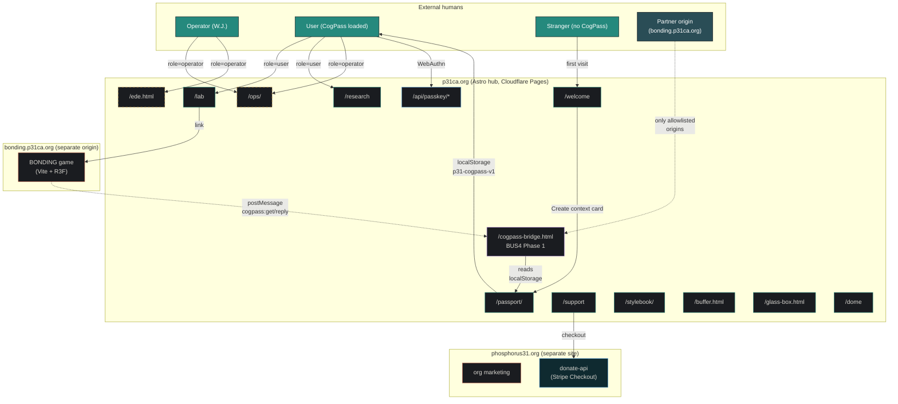
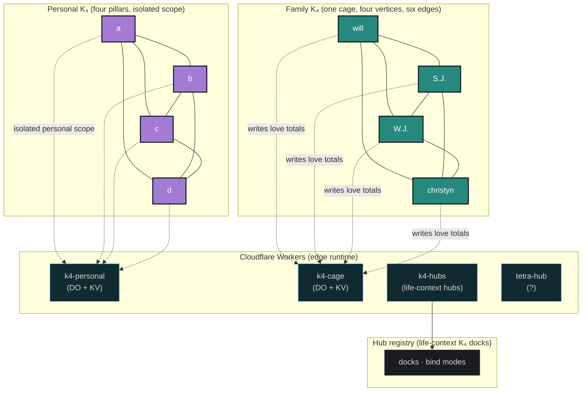
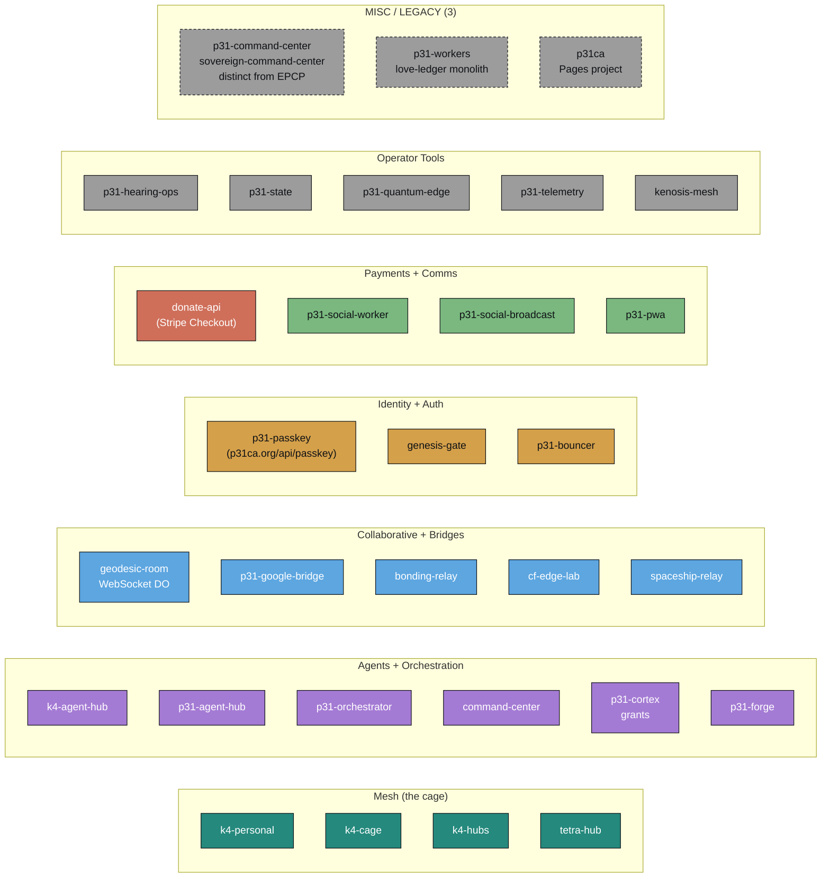
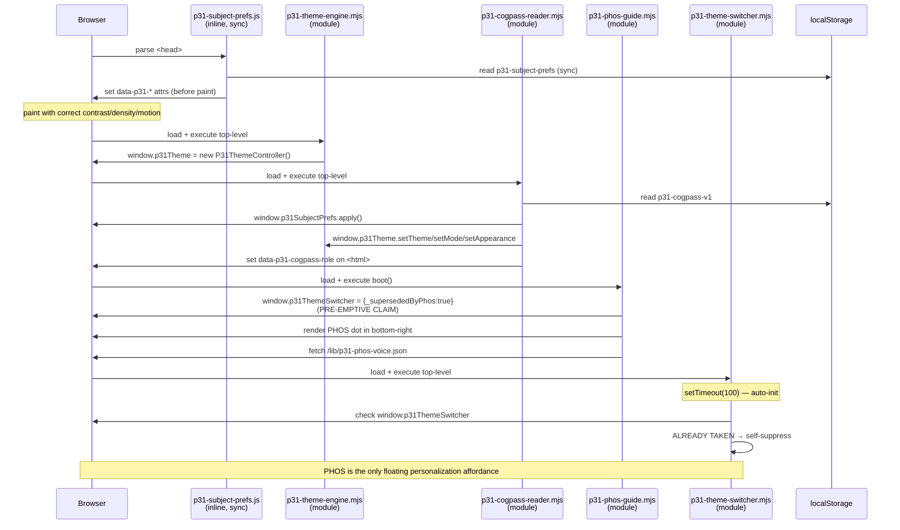
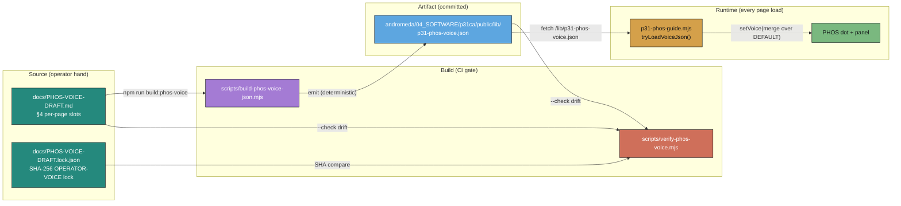
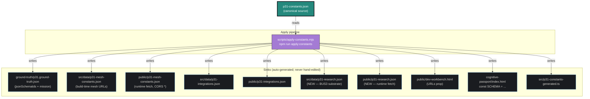
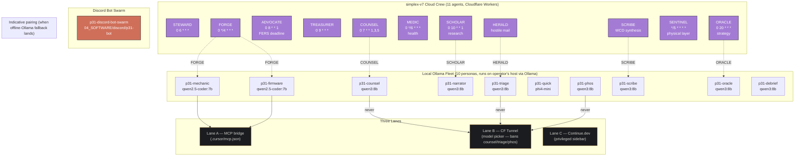
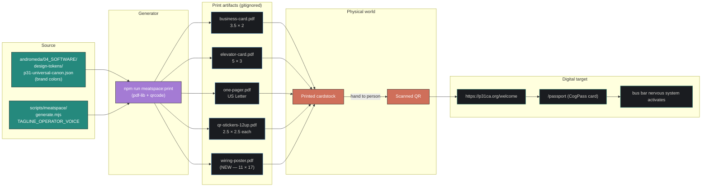

# P31 Andromeda — Wiring Diagram

**Schema:** `p31.wiringDiagram/1.0.0`
**Updated:** 2026-05-01
**Source for the printable poster:** `scripts/meatspace/generate.mjs` (the `generateWiringPoster()` function + `drawQuadrant*` helpers); run via `npm run meatspace:print:wiring-poster`
**Source of truth:** Each named element points to the file that defines it. Edit the file → re-run the verifier listed at section end → diagram regenerates.

---

## How to read this document

This doc has **ten diagrams**, each focused on one concern. Together they describe every connection in the P31 mesh:

| § | Diagram | Concern |
|---|---------|---------|
| 1 | **Hubs + Portals** | Public-facing surfaces (sites, routes, role gates) |
| 2 | **The Cage (K₄ Mesh)** | Family/personal/hub Workers + Durable Objects |
| 3 | **The Edge Fleet** | 30 unique Workers (14 verified + 18 allowlisted; `bonding-relay` and `p31-google-bridge` overlap both lists) |
| 4 | **Bus Bar Nervous System** | BaseLayout 5-script load order + PHOS suppression handshake |
| 5 | **PHOS Voice Pipeline** | PHOS-VOICE-DRAFT.md → JSON → fetch → guide |
| 6 | **CogPass Cross-Origin Bridge (BUS4)** | postMessage iframe sharing localStorage across origins |
| 7 | **Apply-Constants Derivation Graph** | One source → many sinks (Fuller ephemeralization) |
| 8 | **The Swarms** | 10 local Ollama personas + 11 cloud crew + Discord bot |
| 9 | **The Gates (CI Ladder)** | Verifier execution order on every commit |
| 10 | **The Meatspace Bridge** | Print artifacts → QR → /welcome → CogPass → mesh |

Every Mermaid diagram has an ASCII fallback below it for terminal viewing. Both render the same topology.

**Conventions:**
- `=>` = synchronous call / data flow
- `~~` = postMessage / WebSocket / event
- `[boxed]` = file or Worker (deployed unit)
- `(rounded)` = data file (JSON, MD)
- `{diamond}` = decision / role gate
- `((circle))` = external service / human

---

## 1. Hubs + Portals (Public-Facing Surfaces)



**ASCII fallback:**

```
                    ┌─────────────────────────────────────────────┐
                    │  STRANGER (no CogPass)                      │
                    └────────────────┬────────────────────────────┘
                                     │ first visit
                                     ▼
              ┌──────────────────────────────────────────────────┐
              │  /welcome  (front door · PHOS auto-greets)       │
              └──────────────────────────┬───────────────────────┘
                                         │ "Create context card"
                                         ▼
              ┌──────────────────────────────────────────────────┐
              │  /passport/  (CogPass generator · localStorage)  │
              └──────────────────────────┬───────────────────────┘
                                         │ p31-cogpass-v1 stored
                                         ▼
              ┌──────────────────────────────────────────────────┐
              │  USER (CogPass loaded · role: user/operator)     │
              └──┬─────────┬─────────┬──────────┬───────────────┘
                 │         │         │          │
        role=u/o ▼         ▼         ▼   role=o ▼
              /lab     /research  /support     /ops, /ede, /buffer
                 │
                 │ "Play BONDING"
                 ▼
              bonding.p31ca.org  (separate origin · Vite+R3F)
                 │
                 │ postMessage: cogpass:get
                 ▼
        p31ca.org/cogpass-bridge.html  (BUS4 Phase 1 — strict CSP)
                 │
                 │ reads localStorage('p31-cogpass-v1') in p31ca origin
                 │ replies cogpass:reply (only to allowlisted parents)
                 ▼
        bonding receives normalized passport, applies CogPass
```

**Note:** "Bus-bar slot" ≠ "public route". Bus-bar slots are the personalization-aware navigation set declared in `busBar.slots`. Other live routes such as `/dome`, `/cogpass-bridge.html`, `/api/passkey/*`, `/demos`, `/visuals`, `/contracts`, `/composer`, `/cars`, `/fleet`, `/agents`, `/delta`, `/why`, `/connect.html`, `/build`, `/family-pack` are valid endpoints but are not bus-bar slots — they don't appear in `BusBarNav.astro` and don't get role-gated by CogPass.

**Files:**
- Routes: `andromeda/04_SOFTWARE/p31ca/src/pages/*.astro` + `andromeda/04_SOFTWARE/p31ca/public/*.html`
- Bus bar slots: `andromeda/04_SOFTWARE/p31ca/ground-truth/p31.ground-truth.json` `busBar.slots`
- Cross-origin bridge: `andromeda/04_SOFTWARE/p31ca/public/cogpass-bridge.html` + `ground-truth/cogpass-bridge.schema.json`
- Site catalog: `p31-live-fleet.json` `sites`

**Verifies:** `verify:ground-truth` (slot definitions), `verify:cogpass-bridge` (bridge invariants), `verify:fleet-portal` (URL parity)

---

## 2. The Cage (K₄ Mesh)



**ASCII fallback:**

```
        Family K₄ (cage)                Personal K₄ (pillars)
                                                         
           will                                       a
          / | \                                      /│\
         /  |  \                                    / │ \
        /   |   \                                  /  │  \
      S.J.--+-- W.J.                           b───┼───c
        \   |   /                                  \  │  /
         \  |  /                                    \ │ /
          \ | /                                      \│/
        christyn                                      d
            │                                     │
            │ writes love totals             writes pillars
            ▼                                     ▼
     ┌──────────────┐                      ┌──────────────┐
     │  k4-cage     │                      │ k4-personal  │
     │  (DO + KV)   │                      │  (DO + KV)   │
     └──────────────┘                      └──────────────┘
            │                                     │
            └──────────────┬──────────────────────┘
                           │ both expose same JSON shape
                           ▼
                    ┌──────────────┐
                    │   k4-hubs    │  ← life-context hubs (docks, bind modes)
                    └──────────────┘
```

**Constraints:**
- 10ms CPU per request
- 1000 internal subrequests max
- Zero-budget serverless (no D1 unless explicitly opted in)

**Files:**
- Workers: `andromeda/04_SOFTWARE/k4-personal/`, `andromeda/04_SOFTWARE/k4-cage/`, `andromeda/04_SOFTWARE/k4-hubs/`
- Constants: `p31-constants.json` `mesh.k4PersonalWorkerUrl`, `mesh.k4CageWorkerUrl`, `mesh.k4HubsWorkerUrl`
- Live fleet: `p31-live-fleet.json` `workersVerified` (entries 0-3)

**Verifies:** `verify:mesh-canon`, `verify:mesh`, `verify:k4-personal`, `verify:mesh-live` (live probes)

---

## 3. The Edge Fleet (All Workers)



**Headline:** **30 unique Workers** (14 verified + 18 allowlisted; `bonding-relay` and `p31-google-bridge` overlap both lists).

**ASCII fallback (30 unique Workers in 7 categories):**

```
MESH (4)                AGENTS (6)              COLLAB+BRIDGES (5)
─────────────           ──────────────          ─────────────────
k4-personal             k4-agent-hub            geodesic-room (WS DO)
k4-cage                 p31-agent-hub           p31-google-bridge
k4-hubs                 p31-orchestrator        bonding-relay
tetra-hub               command-center          cf-edge-lab
                        p31-cortex (grants)     spaceship-relay
                        p31-forge

IDENTITY+AUTH (3)       PAYMENTS+COMMS (4)      OPERATOR TOOLS (5)
──────────────────      ──────────────────      ──────────────────
p31-passkey  ←  zone    donate-api (Stripe)     p31-hearing-ops
   route bound at       p31-social-worker       p31-state
   p31ca.org/api/       p31-social-broadcast    p31-quantum-edge
   passkey/*            p31-pwa                 p31-telemetry
genesis-gate                                    kenosis-mesh
p31-bouncer

MISC / LEGACY (3)
──────────────────
p31-command-center    ← sovereign-command-center; distinct from EPCP command-center
p31-workers           ← love-ledger monolith (orchestrator is separate Worker)
p31ca                 ← Pages project (https://p31ca.org; not a Worker per se)
```

**Pattern conventions:**
- `<id>.trimtab-signal.workers.dev` — workers.dev hostname for verified Workers
- `donate-api.phosphorus31.org` — only Worker on phosphorus31.org zone (no `api.phosphorus31.org` until deployed)
- `p31ca.org/api/passkey/*` — same-origin route binding so hub static pages can `fetch('/api/passkey/...')` without CORS
- `MESH_LIVE_STRICT=1` — env flag forcing the verify chain to make live HTTP requests instead of trusting JSON

**Files:**
- Verified workers: `p31-live-fleet.json` `workersVerified[0..13]`
- Allowlisted workers: `p31-live-fleet.json` `workersAllowlisted` + `andromeda/04_SOFTWARE/p31ca/security/worker-allowlist.json`
- Zone routes: `andromeda/04_SOFTWARE/p31ca/workers/passkey/wrangler.toml`
- Mesh URL canon: `p31-constants.json` `mesh.*`

**Verifies:** `verify:ecosystem`, `verify:live-fleet:p31ca-mirror`, `verify:mesh-live`, p31ca `security:workers`

---

## 4. Bus Bar Nervous System (Site-Wide Activation)

This is the load-order-sensitive part of the system. Five `<script>` tags in `BaseLayout.astro` `<head>`. The order is doctrinal — change it and PHOS loses its theme switcher absorption.



**ASCII fallback (the load order):**

```
BaseLayout.astro <head> (CWP-PHOS-2026-01 B-2)
─────────────────────────────────────────────────────────────────
1. <script is:inline src="/lib/p31-subject-prefs.js">
                                  │
                                  ▼ before-paint accessibility axes
                                  │ (contrast, density, motion, temperature)
                                  │
2. <script type="module" src="/lib/p31-theme-engine.mjs">
                                  │
                                  ▼ top-level: window.p31Theme = new P31ThemeController()
                                  │
3. <script type="module" src="/lib/p31-cogpass-reader.mjs">
                                  │
                                  ▼ reads localStorage('p31-cogpass-v1')
                                  │ configures p31SubjectPrefs + p31Theme
                                  │ sets data-p31-cogpass-role on <html>
                                  │
4. <script type="module" src="/lib/p31-phos-guide.mjs">
                                  │
                                  ▼ boot(): PRE-EMPTIVE CLAIM
                                  │   window.p31ThemeSwitcher = { _supersededByPhos: true }
                                  │ render PHOS dot
                                  │ fetch /lib/p31-phos-voice.json
                                  │
5. <script type="module" src="/lib/p31-theme-switcher.mjs">
                                  │
                                  ▼ setTimeout(100) — auto-mount
                                  │ checks window.p31ThemeSwitcher
                                  │ ALREADY TAKEN → self-suppress
                                  │
                                  ▼
                       PHOS = only floating affordance
                       Theme engine = still active under the hood
                       CogPass = drives theme + comfort + role
```

**Why this matters:**
- Stylebook + theme-showcase pages can opt out of PHOS to demo the switcher directly
- All other pages get a single personalization point of contact
- The handshake is decoupled (any module can be hot-swapped without breaking the others)

**Files:**
- `andromeda/04_SOFTWARE/p31ca/src/layouts/BaseLayout.astro` (lines 72-97 — the wiring)
- `andromeda/04_SOFTWARE/p31ca/public/lib/p31-subject-prefs.js`
- `andromeda/04_SOFTWARE/p31ca/public/lib/p31-theme-engine.mjs` (P31ThemeController v2.0)
- `andromeda/04_SOFTWARE/p31ca/public/lib/p31-cogpass-reader.mjs`
- `andromeda/04_SOFTWARE/p31ca/public/lib/p31-phos-guide.mjs` (claims switcher in boot)
- `andromeda/04_SOFTWARE/p31ca/public/lib/p31-theme-switcher.mjs` (self-suppression)

**Verifies:** `verify:cogpass-bridge` (the reader is the single normalize point), `verify:cognitive-passport-schema`, `verify:p31-style`

---

## 5. PHOS Voice Pipeline



**ASCII fallback:**

```
   ┌──────────────────────────────────┐
   │  docs/PHOS-VOICE-DRAFT.md  §4    │  ◄─── operator edits on iPad
   │  (13 slots; 1 OPERATOR-VOICE,    │       (vibe-check loop:
   │   12 DRAFT-AGENT-SIMULATED)      │        edit → rebuild → refresh)
   └──────────┬───────────────────────┘
              │
              │ npm run build:phos-voice
              ▼
   ┌──────────────────────────────────┐
   │ scripts/build-phos-voice-json.mjs│  ── parses §4 slot blocks
   │  (deterministic; no timestamp)   │     emits stable-key-ordered JSON
   └──────────┬───────────────────────┘
              │
              ▼
   ┌──────────────────────────────────┐
   │ p31-phos-voice.json              │  ── schema p31.phosVoice/1.0.0
   │  (in p31ca/public/lib/)          │     committed to andromeda
   └──────────┬───────────────────────┘
              │
   ┌──────────┴────────┐
   │                   │ runtime fetch
   │                   ▼
   │      ┌─────────────────────────┐
   │      │ p31-phos-guide.mjs      │  ◄─ loaded by BaseLayout (every page)
   │      │ tryLoadVoiceJson()      │     setVoice() merges over DEFAULT
   │      └────────┬────────────────┘
   │               │
   │               ▼ voiceForPage(pathname)
   │           PHOS dot + panel render with right copy
   │
   │ build --check
   ▼
┌──────────────────────────────────────────────┐
│ scripts/verify-phos-voice.mjs (CI gate)      │
│  1. drift   — re-runs build, byte-equal      │
│  2. schema  — _tag + greeting + hint + ...   │
│  3. vocab   — Tier-0 banned-word scan        │
│  4. SHA     — OPERATOR-VOICE locked vs       │
│               docs/PHOS-VOICE-DRAFT.lock.json│
│  5. coverage — busBar.slots vs voice keys    │
└──────────────────────────────────────────────┘
              ▲
              │ on every commit (in `npm run verify`)
              │
   ┌──────────┴───────────────────────┐
   │ docs/PHOS-VOICE-DRAFT.lock.json  │  ◄─── refreshed via
   │ (SHA-256 per OPERATOR-VOICE slot)│       npm run verify:phos-voice -- --update-lock
   └──────────────────────────────────┘
```

**Doctrine:** Operator's hand is source of truth. Agent drafts unblock implementation; promotion to OPERATOR-VOICE requires (a) rewrite content, (b) change `_tag` in §4, (c) `--update-lock` to add SHA. Silent agent rewrites of OPERATOR-VOICE entries fail CI.

**Live-testing flow:** Edit §4 bullet → `npm run build:phos-voice` → hard-refresh page. Voice updates instantly. No deploy, no commit, no wait.

**Files:** `docs/PHOS-VOICE-DRAFT.md` · `docs/PHOS-VOICE-DRAFT.lock.json` · `scripts/build-phos-voice-json.mjs` · `scripts/verify-phos-voice.mjs` · `andromeda/04_SOFTWARE/p31ca/public/lib/p31-phos-voice.json` · `andromeda/04_SOFTWARE/p31ca/public/lib/p31-phos-guide.mjs`

**Verifies:** `verify:phos-voice`

---

## 6. CogPass Cross-Origin Bridge (BUS4)

```mermaid
sequenceDiagram
  participant U as User browser
  participant B as bonding.p31ca.org<br/>(consumer)
  participant I as cogpass-bridge.html iframe<br/>(p31ca.org origin)
  participant LS as localStorage<br/>(p31ca.org)
  participant N as p31-cogpass-reader.mjs<br/>normalize()

  U->>B: visit bonding.p31ca.org
  B->>U: render page; create hidden iframe
  U->>I: load https://p31ca.org/cogpass-bridge.html
  Note over I: strict CSP: default-src 'none'; script-src 'self'
  I->>I: import normalize() from /lib/p31-cogpass-reader.mjs
  I->>B: postMessage({type:'cogpass:ready', schema, nonce})
  B->>I: postMessage({type:'cogpass:get', nonce})
  Note over I: validate event.origin in ALLOWED_ORIGINS
  I->>LS: getItem('p31-cogpass-v1')
  LS-->>I: {accessLevel:'user', accessibility:{...}, ...}
  I->>N: normalize(passport)
  N-->>I: normalized v1.1.0 passport
  I->>B: postMessage({type:'cogpass:reply', present:true, passport, nonce})
  B->>B: apply CogPass to BONDING UI
  Note over U,B: CogPass crossed origins without server, cookie, or URL param
```

**ASCII fallback:**

```
                  USER on bonding.p31ca.org
                                │
                                │ page load
                                ▼
                ┌───────────────────────────────────┐
                │  bonding.p31ca.org (consumer)     │
                │  creates hidden iframe pointing   │
                │  to https://p31ca.org/cogpass-    │
                │  bridge.html                      │
                └─────────────┬─────────────────────┘
                              │
                              ▼
                ┌───────────────────────────────────┐
                │ p31ca.org/cogpass-bridge.html     │
                │ • strict CSP                       │
                │ • imports normalize() from        │
                │   /lib/p31-cogpass-reader.mjs     │
                │   (the SINGLE RULE — no duplicate │
                │    normalization logic anywhere)  │
                │ • hardcoded ALLOWED_ORIGINS       │
                └─────────────┬─────────────────────┘
                              │
                handshake     │
                ◄─── postMessage('cogpass:ready', {nonce, schema})
                ───► postMessage('cogpass:get', {nonce})
                              │
                              ▼ validate event.origin
                              │
                              ▼ read localStorage('p31-cogpass-v1')
                              │   (succeeds; same-origin from bridge POV)
                              │
                              ▼ normalize() to v1.1.0
                              │
                ◄─── postMessage('cogpass:reply', {present, passport, nonce})

                Wire schema: p31.cogPassBridge/1.0.0
                Privacy: localStorage stays on p31ca.org;
                         bonding only ever sees the normalized payload
                         in postMessage transport (no server, no cookie)
```

**Allowlist policy (zero wildcards):**
```
ALLOWED_ORIGINS = ["https://bonding.p31ca.org"]    ← hardcoded in bridge HTML
                = busBar.crossOriginBridge.allowedOrigins  ← hardcoded in ground-truth
                                  │
                                  │ MUST match exactly (sorted comparison)
                                  ▼
                  verify:cogpass-bridge fails CI on drift
```

**Files:**
- Endpoint: `andromeda/04_SOFTWARE/p31ca/public/cogpass-bridge.html`
- Schema: `andromeda/04_SOFTWARE/p31ca/ground-truth/cogpass-bridge.schema.json`
- Wire spec: `docs/CWP-BUS4-COGPASS-BRIDGE-2026-05.md` (16 sections, 613 lines)
- Privacy disclosure: `andromeda/04_SOFTWARE/p31ca/public/privacy.html` §2g
- Gate: `scripts/verify-cogpass-bridge.mjs` (8 checks · 1 partial-clone existence skip + 7 hard invariants)

**Verifies:** `verify:cogpass-bridge`

---

## 7. Apply-Constants Derivation Graph (Fuller Ephemeralization)



**ASCII fallback (one source, ten sinks):**

```
                     p31-constants.json
                     (canonical · operator-locked numbers)
                              │
                              │ npm run apply:constants
                              ▼
                  ┌──────────────────────────────┐
                  │ scripts/apply-constants.mjs  │
                  └──────────────┬───────────────┘
                                 │
            ┌────────────────────┼────────────────────────┐
            │                    │                        │
            ▼                    ▼                        ▼
   p31.ground-truth     p31-mesh-constants    p31-integrations
   • jsonSchemaIds      (src/data + public)   (src/data + public)
   • mission                       │                       │
   • numbering            ┌────────┴────────┐    ┌────────┴────────┐
            │             ▼                 ▼    ▼                 ▼
            │      build-time     CORS *     build-time      CORS *
            │      Astro import   fetch URL  Astro import    fetch URL
            ▼
   p31-research                dev-workbench.html
   (src/data + public)         URLs prop
   ▲                                  │
   │ research.astro imports           │
   │   src/data/p31-research.json     ▼
   │                          cognitive-passport/index.html
   │                          const SCHEMA = "p31.cognitivePassport/1.1.0"
   │
   └────── 22 papers list                       ▲
                                                │
                                                │ also writes
                                                │
                                       src/p31-constants-generated.ts
                                       (TypeScript constants for Cursor IDE)

   GOLDEN RULE: never edit a sink directly. Edit p31-constants.json,
                run apply:constants, commit the regenerated sinks.
                CI gate verify:constants asserts byte-equality.
```

**Files:**
- Source: `p31-constants.json`
- Pipeline: `scripts/apply-constants.mjs`
- Sinks: 10 files across `andromeda/04_SOFTWARE/p31ca/`, `cognitive-passport/`, `src/`

**Verifies:** `verify:constants` (golden behavior — applies in dry mode and compares)

---

## 8. The Swarms (Local Ollama + Cloud Crew + Bots)



**ASCII fallback:**

```
LOCAL OLLAMA FLEET (10 personas; offline · operator host)
─────────────────────────────────────────────────────────
ID              BASE MODEL              ROLE
p31-mechanic    qwen2.5-coder:7b        TS / Workers / Pages / D1
p31-firmware    qwen2.5-coder:7b        ESP-IDF / Node Zero
p31-counsel     qwen3:8b                Pro se Georgia drafting
p31-narrator    qwen3:8b                Grants + research synthesis
p31-triage      qwen3:8b                Hostile-mail 4-tier JSON
p31-quick       phi4-mini               Commit messages / one-liners
p31-phos        qwen3:8b                Children companion (rehearsal)
p31-scribe      qwen3:8b                Accommodation log + WCD
p31-oracle      qwen3:8b                Q-factor / trimtab patterns
p31-debrief     qwen3:8b                Post-incident processing

   THREE LANES:
   A. MCP bridge (.cursor/mcp.json)        ← summon as Cursor tool
   B. CF Tunnel (workers.dev model picker) ← BANNED for counsel/triage/phos
                                              (cloud round-trip)
   C. Continue.dev (privileged sidebar)    ← legal drafts + hostile mail

SIMPLEX-V7 CLOUD CREW (11 agents; Cloudflare Workers + cron + D1)
─────────────────────────────────────────────────────────────────
STEWARD    0 6 * * *           daily briefing + deadlines
COUNSEL    0 7 * * 1,3,5       Georgia family court drafts
ADVOCATE   0 8 * * 1           FERS Sep 30 2026 ← HARD DEADLINE
TREASURER  0 9 * * *           Grants + Ko-fi + budget
FORGE      0 */4 * * *         Worker health + WCD drafts
MEDIC                          (operator health envelope)
HERALD                         Hostile-mail voltage classification
SCHOLAR                        Research synthesis
SCRIBE                         WCD synthesis from agent handoffs
SENTINEL                       Physical-layer interface (PHOS bridge)
ORACLE                         Strategy / Q-factor / trimtab

DISCORD BOT SWARM
─────────────────
p31-discord-bot-swarm  ←  andromeda/04_SOFTWARE/discord/p31-bot
                          schema p31.discordBotSwarm/1.0.0
                          npm run verify:discord-bot

   OFFLINE-FALLBACK PAIRING (queued: CWP-P31-SIMPLEX-OFFLINE-OLLAMA)
   ──────────────────────────────────────────────────────────────
   simplex-v7 lane    →    local persona
   FORGE              →    p31-mechanic
   COUNSEL            →    p31-counsel
   SCHOLAR            →    p31-narrator
   HERALD             →    p31-triage
   SCRIBE             →    p31-scribe
   ORACLE             →    p31-oracle
   (no lane yet)      →    p31-firmware (hardware track owns)
   (n/a)              →    p31-quick (commit msgs only)
   (n/a)              →    p31-phos  (routed via SENTINEL when shipped)
   (no lane yet)      →    p31-debrief (will hand off to SCRIBE)
```

**Files:**
- Personas: `scripts/p31-fleet-ten/models.json` + `prompts/*.role.txt`
- MCP bridge: `scripts/ollama-mcp/server.mjs` + `.cursor/mcp.json`
- Cloud crew registry: `simplex-v7/src/agents/registry.ts`
- Discord swarm: `andromeda/04_SOFTWARE/discord/p31-bot/`

**Verifies:** `verify:fleet-ten`, `verify:ollama-mcp`, `verify:simplex`, `verify:discord-bot`, `verify:fleet-llm-bridge`

---

## 9. The Gates (CI Verifier Ladder)

The verify chain runs in order on every commit. Fast-fail. Each gate locks one invariant.

```
npm run verify  (root, ordered)
├── verify:alignment                    ← registry of every source + derivation
├── verify:nonprofit                    ← nonprofit ground truth
├── verify:bus-bar
├── verify:cogpass-reader
├── verify:protocol-registry            ← contract registry
├── build:contract-registry             ← rebuild, then verify drift
├── verify:contract-registry
├── verify:sovereign-chain              ← Ed25519 attestation chain
├── verify:sovereign-layers
├── verify:launch-readiness-config
├── verify:reports-index
├── verify:reports-automation
├── verify:verify-pulse                 ← pulse beacon
├── verify:reports-promoted
├── verify:glass-box                    ← public transparency
├── verify:demos
├── verify:facts                        ← p31-facts.json invariants
├── verify:subscriptions                ← AI subscription stack
├── verify:p31-env                      ← env catalog
├── verify:shipbox
├── verify:passport                     ← cog passport sync
├── verify:cognitive-passport-schema    ← p31.cognitivePassport/1.1.0 ≡ shared
├── verify:cognitive-passport-profiles  ← audience matrix
├── verify:cogpass-bridge               ← BUS4 8 checks · 1 skip + 7 hard invariants
├── verify:phos-voice                   ← voice JSON drift + SHA + Tier-0 + coverage
├── verify:constants                    ← apply:constants golden behavior
├── verify:mesh-canon
├── verify:ecosystem
├── verify:live-fleet:p31ca-mirror
├── verify:production-readiness
├── verify:launch-lane-sync
├── verify:map-pipeline
├── verify:p31-style                    ← universal canon
├── verify:quantum-material-u
├── verify:canon-css
├── verify:phos-truth
├── verify:starfield
├── verify:fleet-ten
├── verify:fleet-llm-bridge
├── verify:ollama-mcp
├── verify:ollama-tunnel-config
├── verify:style-alignment
├── verify:command-center
├── verify:p31ca-contracts              ← ground-truth + synergetic + lattice oracle + economy
├── verify:egg-hunt
├── verify:onboarding                   ← planetary onboard anchors
├── verify:fleet-portal
├── verify:cars-wire                    ← C.A.R.S. WS message alignment
├── verify:geodesic-wire-fixtures
├── verify:quantum-deck
├── verify:k4-agent-hub
├── verify:agents-mirror
├── verify:discord-bot
├── verify:social-engine
├── verify:simulations
├── verify:poets-room
├── verify:runbooks
├── verify:delta-language               ← DELTA voice + topology words
├── verify:public-voice                 ← identity-first + Tier B/C
├── verify:public-sanitization
├── verify:phos-play-session-bridge
├── verify:atmosphere-ramp
├── build:doc-index                     ← rebuild searchable doc library
├── verify:doc-index                    ← drift check
├── verify:wiring-ci-ladder
├── verify:verify-pipeline
├── verify:doc-library:p31ca-mirror
├── verify:github-org
├── verify:simplex                      ← simplex-v7 SIMPLEX + SENTINEL
├── verify:simplex-email
├── verify:simplex-bootstrap
├── verify:edge-lab                     ← cf-edge-lab wrangler dry-run
├── build
├── soup:prep:check                     ← C.A.R.S. dist + assets fresh
└── verify:triper
```

**Promotion ladder:**

```
verify           ← ship bar (above)
verify:all       ← + p31ca full build chain + security:check
release:check    ← root verify + p31ca build (only if andromeda present)
release:public   ← verify + strict mesh + hub:ci + security:check
release:all      ← strict mesh + hub verify + p31ca security:check
p31:all          ← release:all + validate:full + fleet:probe
                                + ecosystem glass + Playwright e2e
                                + Semgrep (soft if installed)
```

**Files:** `package.json` `scripts.verify` (root) · individual gates in `scripts/verify-*.mjs`

---

## 10. The Meatspace Bridge (Print → Scan → Onboard)



**ASCII fallback:**

```
DIGITAL                                          MEATSPACE                 DIGITAL
─────────────────────────────                    ─────────────             ──────────────
  p31-universal-canon.json (colors)                                          
  PHOS-VOICE-DRAFT.md      (tagline)                                         
        │                                                                    
        │  npm run meatspace:print                                           
        ▼                                                                    
  scripts/meatspace/generate.mjs ──────► dist/meatspace/                     
                                          ├─ p31-business-card.pdf            
                                          ├─ p31-elevator-card.pdf            
                                          ├─ p31-one-pager.pdf                
                                          ├─ p31-qr-stickers-12up.pdf         
                                          └─ p31-wiring-poster.pdf (NEW)      
                                                  │                          
                                                  ▼ print on cardstock        
                                          ┌────────────────────┐             
                                          │ Physical artifact  │             
                                          │ (sticker / card)   │             
                                          └─────────┬──────────┘             
                                                    │ given to a person      
                                                    │ scanned                
                                                    ▼                        
                                          ┌────────────────────┐             
                                          │ phone QR scanner   │             
                                          └─────────┬──────────┘             
                                                    │                        
                                                    ▼                        
                                                                  https://p31ca.org/welcome
                                                                            │
                                                                            ▼
                                                                  PHOS auto-greets, offers
                                                                  context card creation
                                                                            │
                                                                            ▼
                                                                  /passport — CogPass made
                                                                            │
                                                                            ▼
                                                                  Bus bar nervous system
                                                                  configures rest of site
                                                                  for this person
```

**Five artifact types as of 2026-05-01:**

| Artifact | Use | Tagline embedded |
|----------|-----|------------------|
| `business-card.pdf` | Hand to people | "For every family out there figuring it out as they go..." (back) |
| `elevator-card.pdf` | Therapist office, library bulletin board | Same (front, primary) |
| `one-pager.pdf` | Grant meetings, FERS appeal envelope | Hero block + footer |
| `qr-stickers-12up.pdf` | Camden County stickers | Sheet header (12-up sheet) |
| `wiring-poster.pdf` | Operator wall reference (this doc, printed) | Header |

**Files:**
- Generator: `scripts/meatspace/generate.mjs` (`generateWiringPoster()` + `drawQuadrantPortals/Fleet/BusBar/Swarms` helpers — D-7 added 2026-05-01)
- Canon source: `andromeda/04_SOFTWARE/design-tokens/p31-universal-canon.json`
- Tagline source: `docs/PHOS-VOICE-DRAFT.md` §3.1 (mirrored as `TAGLINE_OPERATOR_VOICE` constant)

**Run:** `npm run meatspace:print` (all) or `npm run meatspace:print:<artifact>` (one)

---

## Legend + Glossary

| Symbol | Meaning |
|--------|---------|
| `=>` | Synchronous call / data flow |
| `~~` | postMessage / WebSocket / event |
| `[boxed]` | File or Worker (deployed unit) |
| `(rounded)` | Data file (JSON, MD) |
| `{diamond}` | Decision / role gate |
| `((circle))` | External service / human |

| Term | Definition |
|------|------------|
| **K₄** | Complete graph on 4 vertices (one cage, six edges between four people/pillars) |
| **CogPass** | Cognitive Passport — personalization card stored in `localStorage('p31-cogpass-v1')` |
| **PHOS** | The personality layer / face of P31 (named for Phosphorus-31) |
| **Bus bar** | The nervous system: BaseLayout + 5 scripts + ground-truth nav |
| **Wedge** | One unit of work in a CWP (Controlled Work Package) |
| **OPERATOR-VOICE** | A copy line written by the operator; SHA-locked against agent rewrites |
| **DRAFT-AGENT-SIMULATED** | Placeholder copy by an agent under operator-defined voice rules |
| **Tier-0 vocabulary** | Stranger-facing words: brain, tools, free, adapt, yours, safe, help, here |
| **Gray Rock** | Layer-1 minimal-stimulus mode; pinned when CogPass `screenComfort < 10` |
| **Glass box** | Public transparency surface — every CI gate's output, every deploy, every audit |
| **WCD** | Work Constraint Document (paper that documents one architectural constraint) |

---

## How this document stays true

This doc is a SOURCE in `p31-alignment.json`. Every major edit triggers `verify:alignment` (registry shape) + `build:doc-index` + `verify:doc-index` (catches the new doc in the searchable library). The file paths cited above are real; the verifiers listed run on every commit. If a system changes (new Worker, new persona, new gate), update this doc in the same commit and the registry edge stays clean.

When you walk into a session months from now and ask "wait, what calls k4-personal?" — open this file. The answer is in §2 + §3.

When a new agent picks up a CWP and asks "where do I add my new system?" — open this file. The categorization in §1-§10 is the canonical taxonomy.

---

*Print this on 11 × 17 (tabloid) cardstock with `npm run meatspace:print:wiring-poster`. Pin it where you'll see it.*

*"The geometry holds. The chemistry is honest. Every line in this diagram is a wire that carries actual current."*

💜🔺💜
