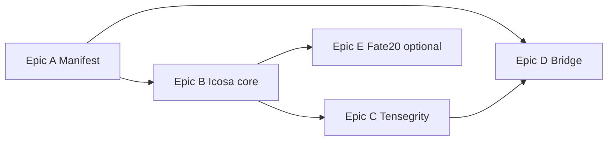

# Work Package: Synergetic Multi-Dome Stack
## *A Fuller-grade synthesis of p31ca, GEODESIC, and Spaceship Earth*

**Status:** proposed · **Owner:** P31 Labs · **Class:** product + platform  
**Version:** 1.0 · **Date:** 2026-04-25 · **M1 (Epic A):** `synergetic-manifest.json` + `verify:synergetic` in p31ca `prebuild` (2026-04-25)  

---

## 1. North star (what would make Bucky raise an eyebrow—approvingly)

R. Buckminster Fuller’s useful ideas for *this* stack are not nostalgia for the Montreal biosphere. They are **operational heuristics**:

| Fuller idea | P31 expression | What “done” looks like |
|-------------|----------------|------------------------|
| **Spaceship Earth** | The **Spaceship Earth** PWA is literally the operating metaphor: one vehicle, limited resources, shared fate. | Every dome view answers: *What system am I inside, and what does it need right now?* |
| **Ephemeralization** | Edge/serverless, PGlite, offline-first, minimal JS surface for the same function. | Same geodesic truth with **fewer** duplicate implementations over time, not more. |
| **Tensegrity** | K₄ and mesh **edges** carry *relations*; plates/shells carry *enclosure*—compression and tension don’t muddle. | Graph data, UI chrome, and 3D shell stay **independently swappable** behind one seam. |
| **Synergetics (60° thinking)** | Tetra / octa / icosa as *one family*; **G**EODESIC builder + **icosa** observatory + **K₄** cockpit as phases of one system. | One documented map from “unit” (tetra) → “dome” (subdivided icosa) → “life graph” (inscribed 4-vertex). |
| **Dymaxion (whole map)** | `lattice.html`, `hub-landing.json`, `p31.ground-truth.json`, and SpEC rooms **must not contradict** each other. | A single **manifest** of URLs, Three versions, and feature flags, consumed by static hub and PWA. |
| **“Doing more with less”** | One shared icosa/panel index module instead of N forks. | **@p31/synergetic-geometry** (or `packages/`) with tests; consumers import—no copy-paste. |

**The special thing:** you already own **all three** symbolic layers: **K₄** on `/dome` (Astro), **2V/1V geodesic shell** in `ObservatoryRoom.tsx`, and **icosa-first** static domes in `observatory.html` / `geodesic.html` / `builder.html`. The work is to **splice them** into *one* coherent, documented, and mathematically honest instrument—not a rebrand.

---

## 2. Ground truth: what exists today (no guessing)

| Layer | Path | Role |
|-------|------|------|
| **Astro K₄ “Sovereign Cockpit”** | `andromeda/04_SOFTWARE/p31ca/src/pages/dome.astro` | Three r183, tetra, loading ritual, face logic tied to hub. |
| **Routing / contracts** | `andromeda/04_SOFTWARE/p31ca/ground-truth/p31.ground-truth.json`, `public/_redirects` | `/dome` canonical, Three pin. |
| **Static data dome (icosa 2?)** | `andromeda/04_SOFTWARE/p31ca/public/observatory.html` | `IcosahedronGeometry(3, 2)` → panels; node cards; search. |
| **Platonic + strut builder** | `p31ca/public/geodesic.html`, `builder.html` | Icosa/tetra/octa in snap space; “GEODESIC” product. |
| **Navigation graph** | `p31ca/public/lattice.html`, `ecosystem.html`, about pages | User-facing map between cockpit, observatory, GEODESIC, Spaceship Earth. |
| **Spaceship Earth PWA** | `andromeda/04_SOFTWARE/spaceship-earth/` | Rooms: `observatory`, `geodesic`, …; `TriStateCamera` (`dome` mode); `DeltaMesh` / K₄; `ObservatoryRoom` geodesic shell + inner tetra graph. |
| **Drei / R3F icosa** | e.g. `PosnerMolecule.tsx`, `App.tsx` imports | Icosahedron in scene graph (different use than data dome, same solid family). |
| **Bridge page** | `p31ca/public/spaceship-earth.html` | Points at deployed Spaceship Earth app. |

**Invariants to preserve:** ground-truth verification (`verify:ground-truth`), passport sync rules when touching p31ca public gen, and operator privacy in any live graph (see `CLAUDE.md` / `.cursorrules`).

---

## 3. Epics (build order)

### Epic A — *Synergetic manifest* (Dymaxion index)

**Goal:** One machine-readable **surface map** for humans and CI: which URL is canonical, which experiment is `PROTOTYPE` vs `LIVE`, which Three rNNN is required.

**Deliverables**
- A.1 **`synergetic-manifest.json`** (suggested: `p31ca/ground-truth/` or `andromeda/04_SOFTWARE/packages/p31-constants/`) with: `entries[]` of `{ id, type: "astro"|"static"|"pwa", pathOrUrl, threeRevision, roomId?, status }`.
- A.2 **npm script** `verify:synergetic` that fails if: `dome.astro` / `observatory.html` / Spaceship `package.json` Three pins diverge from manifest (or if manifest is missing an entry that ground-truth lists).
- A.3 **Human one-pager** — this file §2; discoverability: **`P31-ROOT-MAP.md`** §5 (Narrative & spec / `docs/`).

**Acceptance criteria**
- CI or prebuild can run the verifier locally with zero false positives on `main` state of record.
- Adding a *new* dome surface force-updates the manifest (fail closed).

**Risk:** low · **Est.:** 0.5–1 engineer-week.

---

### Epic B — *Icosahedral source of truth* (Ephemeralize duplication)

**Goal:** `IcosahedronGeometry` + panel extraction + face indexing written **once**, consumed by:
- static `observatory.html` (or thin adapter),
- future lightweight preview on p31ca,
- optional visual regression tests.

**Deliverables**
- B.1 Package **`@p31/synergetic-geometry`** (or `andromeda/04_SOFTWARE/packages/synergetic-geometry/`) with:
  - `buildIcosaDome({ subdivision, radius })` → `{ positions, faceIndices, panelMeta }`.
  - Unit tests: face count for subdivision 0/1/2; golden vectors for a few reference vertices.
- B.2 **ESM + types**; optional **headless** three dependency or **pure math** from icosa construction (strong preference for *math-first* to keep tests off WebGL if feasible).
- B.3 **Observatory static**: replace inlined construction with `import` from built bundle, or a **generated** `observatory-geometry.mjs` checked in and stamped by a script (choose one; avoid leaving two divergent hand-written loops).

**Acceptance criteria**
- Same subdivision + radius in tests reproduces the **same** face count the UI expects today (document the number: e.g. 80 / hemisphere semantics where applicable—see `ecosystem.html` copy and code).
- No behavioral regression on panel pick / raycast in static observatory (manual or Playwright).

**Risk:** medium (perf + bundling of static site) · **Est.:** 1–2 engineer-weeks.

---

### Epic C — *Tensegrity seam* (graph vs shell)

**Goal:** In Spaceship **ObservatoryRoom**, the **K₄ / graph** and **geodesic shell** already coexist; make the *contract* explicit: graph nodes never need to “know” mesh buffers; the shell only receives **attributed points** and **state colors**.

**Deliverables**
- C.1 **`ObservatoryAdapter`** interface: `getNodePositions4()` → inscripted tetra; `getShellTheme()` → palette tokens; `subscribeTelemetry()` (optional) from PGlite/telemetry when ready.
- C.2 **Storybook** or dev-only **debug scene** to swap mock vs live data without full app (if Storybook not present, use a `/debug-observatory` route behind dev flag only).
- C.3 Document **2V/1V** shell comments in one place (link to synergetics 2↔1 frequency in plain language; no pseudoscience—just *engineering labels*).

**Acceptance criteria**
- Swapping a mock `VERTICES` source does not require editing shell mesh code.
- `TriStateCamera` `dome` mode remains the default “orbit the instrument” experience.

**Risk:** low–medium · **Est.:** 1 engineer-week (plus your testing discipline).

---

### Epic D — *Dymaxion bridge* (p31ca ↔ PWA)

**Goal:** A user in **p31ca** always has an obvious, non-dark-pattern path into **Spaceship Earth** to the *matching* room, and *back* to the right static doc.

**Deliverables**
- D.1 **Deep links** with documented query: e.g. `https://<spaceship-host>/#observatory?src=p31ca&route=observatory.html`.
- D.2 **spaceship-earth.html** and `lattice.html` updated to use the same **URL builder** (small TS or JS module in p31ca `scripts/` that emits links for hub generation).
- D.3 **“Open in hub”** from PWA (footer or help) to `/observatory-about.html` and `/dome` as appropriate.

**Acceptance criteria**
- No 404; hash routing survives; accessible link text (not icon-only for primary action).
- Ground-truth / redirects updated if a canonical public URL changes.

**Risk:** low (mostly UX + copy) · **Est.:** 0.5 engineer-weeks.

---

### Epic E — *Fate 20* (optional, ethical “d20 as icosa”)

**Goal:** Make the **icosa** connection explicit: **20 faces of attention**, not gambling—**spoon-weighted** or **educational** use only, with an operator toggle default **off** in high-stress contexts.

**Deliverables**
- E.1 “Explain this dome” non-modal: 3 sentences tying **icosa** → **geodesic** → “same symmetry as a 20-sided die; here we use it for *orientation*, not *chance*,” unless fate mode is on.
- E.2 Optional **Fate 20** mode: pick **face 1..20** with keyboard-safe animation; log choice to local store only; **no** telemetry without explicit opt-in.
- E.3 If ever shipped: document under **Cognitive Passport** or operator doc as *assistive* “break ties when executive function is stuck,” not a game of chance for minors.

**Acceptance criteria**
- Default UX remains calm; feature is discoverable but not pushy; copy reviewed for AuDHD-friendly reading level.

**Risk:** product/ethics (medium) · **Est.:** 0.5–1 week if limited to static + copy; +1 if integrated in R3F room.

---

## 4. Milestone plan (suggested)

| Milestone | Epics | Exit criterion |
|-----------|--------|------------------|
| **M1 — Map locked** | A | `verify:synergetic` green; manifest in repo. |
| **M2 — One icosa** | A, B | Shared geometry used by `observatory.html`; tests green. |
| **M3 — Tensegrity** | C | Interface + at least one alternate mock graph path. |
| **M4 — Bridge** | D | p31ca ↔ PWA two-way with documented URLs. |
| **M5 — Instrument complete** | E (opt.) | Icosa story told honestly; optional Fate 20 behind toggles. |

---

## 5. Non-goals (guardrails)

- No replacement of `p31.ground-truth.json` with an informal JSON—**extend** the established pattern or fold manifest into ground-truth with a schema bump.
- No **single** giant React bundle for p31ca static files; keep static pages **lean**.
- No shipping **live family identifiers** in public graph JSON without an explicit, reviewed policy (match existing cage/KV story).
- No “Bucky” cargo cult: **if it doesn’t improve clarity, testability, or operator agency,** it is out of scope.

---

## 6. Success metrics

| Metric | How we know |
|--------|-------------|
| **One icosa** | `grep -r IcosahedronGeometry p31ca/public` shows **one** construction path to rule them all (or generated bundle). |
| **No drift** | `verify:synergetic` passes on CI prebuild. |
| **User clarity** | New user can answer in <60s: *What is the relationship between /dome, observatory, and Spaceship?* (lab session / recorded click test). |
| **Operator fit** | Sessions under spoon deficit still complete primary tasks (per operator feedback), even if Fate 20 exists.

---

## 7. Risk register (short)

| Risk | Mitigation |
|------|------------|
| **Three version skew** | Manifest + verifier (Epic A). |
| **Static site bundle bloat** | Math-first module; code-split; avoid pulling full R3F into static. |
| **Over-metaphor** | All copy vetted: *instrument*, not *mystic*. |
| **Legal/privacy in graph** | Reuse existing edge/KV rules; no new PII in client bundles. |

---

## 8. File checklist (first commits)

1. `docs/WORK-PACKAGE-SYNERGETIC-GEODESIC-STACK.md` (this document).  
2. `synergetic-manifest.json` + `scripts/verify-synergetic.mjs` (or turbo task).  
3. `packages/synergetic-geometry/*` (package.json, ts, tests).  
4. `p31ca/public/observatory.html` refactor to import shared panel builder.  
5. `spaceship-earth/`: `ObservatoryAdapter` + small doc in `src/components/rooms/README-observatory.md` (optional).  
6. Link updates: `lattice.html`, `spaceship-earth.html`, PWA help/deep link section.

---

## 9. Why this is “truly special”

Fuller’s pride would come from **clarity and integrity**: the **tet** as minimum system, the **dome** as maximum enclosure per unit of structure, and the **map** that shows the whole without lying. This package doesn’t add glitter—it **fuses** what you have already built into a **verifiable, minimal, life-sized instrument** for the operator and the family mesh. That is the kind of *special* that ships and ages well.

---

*End of work package v1.0. Revise with manifest path and package name once M1 is green.*
