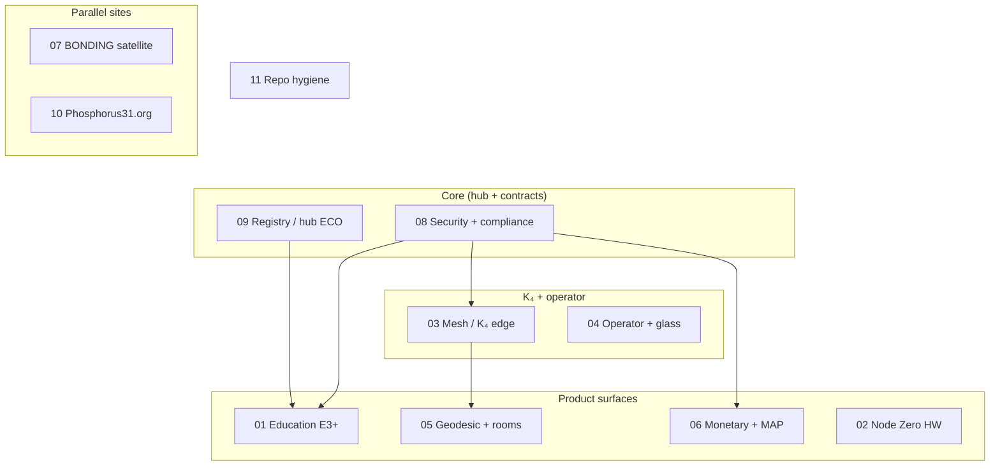

# P31 — Production-converging CWP set (index)

**Schema:** `p31.cwpConvergence/1.0.0` (informal)  
**Updated:** 2026-04-28  
**Normative “everything connected” bar:** `docs/ECOSYSTEM-PRODUCTION-11.md`  
**Unifying home verify:** `npm run verify` (bonding-soup) + `npm run p31:converge` +, when p31ca changes, `andromeda/04_SOFTWARE/p31ca` `npm run deploy` after `npm run verify`.

**Convergence scorecard (2026-04-28):** **9 of 11** with a clear end state: **8 CLOSED** (03, 04, 05, 06, 07, 09, 10, 11), **1 ONGOING** (08 — recurring security gate, not a calendar close), **2 OPEN** by design — [01 E3+](CWP-01-EDU-E3-PORTAL.md) (policy: [EDU-E3-POLICY-2026-01.md](../EDU-E3-POLICY-2026-01.md)), [02 Node Zero](CWP-02-NODE-ZERO.md) (hardware). **Mobile ops (6 phases):** [MOBILE-OPS-PHASE2.md](../MOBILE-OPS-PHASE2.md) through [PHASE6.md](../MOBILE-OPS-PHASE6.md) + `npm run morning` / `npm run mobile-ops:full` on `main`.

---

## How to read this set

- Each file **`CWP-NN-*.md`** is a **standalone** work package: objective, in/out scope, phases, **production convergence** (commands + live probes), dependencies.
- **Convergence** means: the track reaches a state where **CI bar + live checks + deploy story** are documented and repeatable, not one-off manual heroics.
- **Dependencies** are listed; parallel tracks do not block each other unless noted.

## Program map (mermaid)

## CWP inventory

| ID | File | One-line | Depends on | Parallel with |
|----|------|----------|------------|---------------|
| 01 | [CWP-01-EDU-E3-PORTAL.md](CWP-01-EDU-E3-PORTAL.md) | Gated E3+ portal, policy → Worker → UI | Passkey live; policy doc | 02, 05, 06, 10 |
| 02 | [CWP-02-NODE-ZERO.md](CWP-02-NODE-ZERO.md) | ESP32-S3 + LVGL milestones to NZ-05 | None (HW repo) | All |
| 03 | [CWP-03-MESH-K4-EDGE.md](CWP-03-MESH-K4-EDGE.md) | Constants ↔ live mesh; glass green | p31-constants | 04, 05 |
| 04 | [CWP-04-OPERATOR-GLASS.md](CWP-04-OPERATOR-GLASS.md) | command-center, shift, /ops probes | p31-ecosystem ingest | 03 |
| 05 | [CWP-05-GEODESIC-ROOMS.md](CWP-05-GEODESIC-ROOMS.md) | Campaign + geodesic-room wire + static | ground-truth geodesic | 01, 03 |
| 06 | [CWP-06-MONETARY-MAP.md](CWP-06-MONETARY-MAP.md) | Donate, creator economy, `verify:map-pipeline` | payment constants | 01 |
| 07 | [CWP-07-BONDING-SATELLITE.md](CWP-07-BONDING-SATELLITE.md) | bonding.p31ca.org + registry parity | Ecosystem glass URL | 10 |
| 08 | [CWP-08-SECURITY-COMPLIANCE.md](CWP-08-SECURITY-COMPLIANCE.md) | `security:check`, allowlist, CORS, Access | p31ca present | All |
| 09 | [CWP-09-REGISTRY-HUB-ECO.md](CWP-09-REGISTRY-HUB-ECO.md) | One hub truth; card/add/remove playbooks | A/B + legacy sunset (done) | 07 |
| 10 | [CWP-10-PHOSPHORUS31-SITE.md](CWP-10-PHOSPHORUS31-SITE.md) | Org site, separate deploy, no hub mix | Org decision | 01–09 |
| 11 | [CWP-11-REPO-HYGIENE.md](CWP-11-REPO-HYGIENE.md) | PRs, auto-merge, alignment, doc index | None | All |

## Global production convergence (every CWP)

When closing any package, the operator (or agent) must record:

1. **Git:** merge to protected `main` (or home `main` for bonding-soup-only changes) with required checks.
2. **Build:** p31ca `npm run verify` → `npm run build` if `andromeda/.../p31ca` changed.
3. **Deploy:** `npm run deploy` in p31ca when static or Worker contract changes; Workers per `p31ca` + `ECOSYSTEM-PRODUCTION-11` order when applicable.
4. **Live:** re-run `npm run ecosystem:glass` (or targeted curls) and update **exceptions** in docs if a probe is intentionally down.
5. **Alignment:** `p31-alignment.json` and `p31-facts` not contradicted; run root `npm run verify:alignment` for registry edits.

## Closed predecessors (context only)

- **Wave 1 (2026-04-28):** [04 Operator glass](CWP-04-OPERATOR-GLASS.md), [07 BONDING satellite](CWP-07-BONDING-SATELLITE.md), [09 Registry / hub ECO](CWP-09-REGISTRY-HUB-ECO.md) — closed after verify + docs.
- **Wave 2 (2026-04-28):** [03 Mesh / K₄ edge](CWP-03-MESH-K4-EDGE.md), [06 Monetary + MAP](CWP-06-MONETARY-MAP.md), [11 Repo hygiene](CWP-11-REPO-HYGIENE.md) — glass + `verify:mesh` / `verify:ecosystem` + MAP/monetary + hygiene log.
- **Wave 3 (2026-04-28):** [05 Geodesic + rooms](CWP-05-GEODESIC-ROOMS.md), [10 Phosphorus31.org](CWP-10-PHOSPHORUS31-SITE.md) — closed; runbooks + `verify:geodesic-campaign` + org smoke; [08](CWP-08-SECURITY-COMPLIANCE.md) = **ongoing** gate (not closed); **E3 policy skeleton:** [EDU-E3-POLICY-2026-01.md](../EDU-E3-POLICY-2026-01.md); **org runbook:** [PHOSPHORUS31-ORG-SITE.md](../PHOSPHORUS31-ORG-SITE.md).
- **Open work:** [01 E3+](CWP-01-EDU-E3-PORTAL.md) (code blocked on policy), [02 Node Zero](CWP-02-NODE-ZERO.md) (hardware), **08** = recurring.
- `CWP-P31-DEPLOY-2026-02` — deploy sprint closed.
- `CWP-P31-PHASE-D-2026-01` — Tracks A (legacy) & B (passkey CAGE) closed in production.
- `CWP-P31-PHASE-D-2026-02` — Track C/D + hygiene (supersedes in part; this index is the superset).

## Pointer from repo root

See **`/home/p31/CWP-P31-CONVERGENCE-SET-2026-01.md`**.
